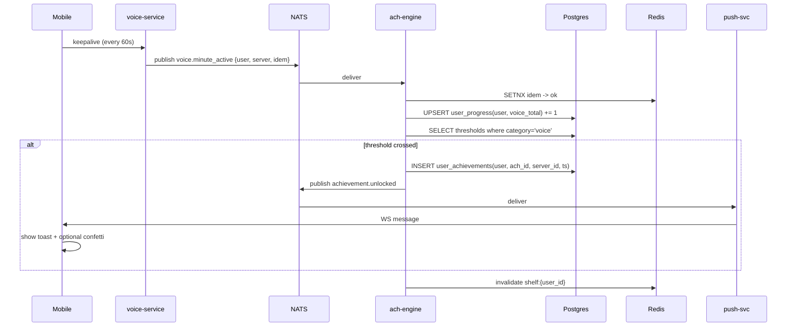
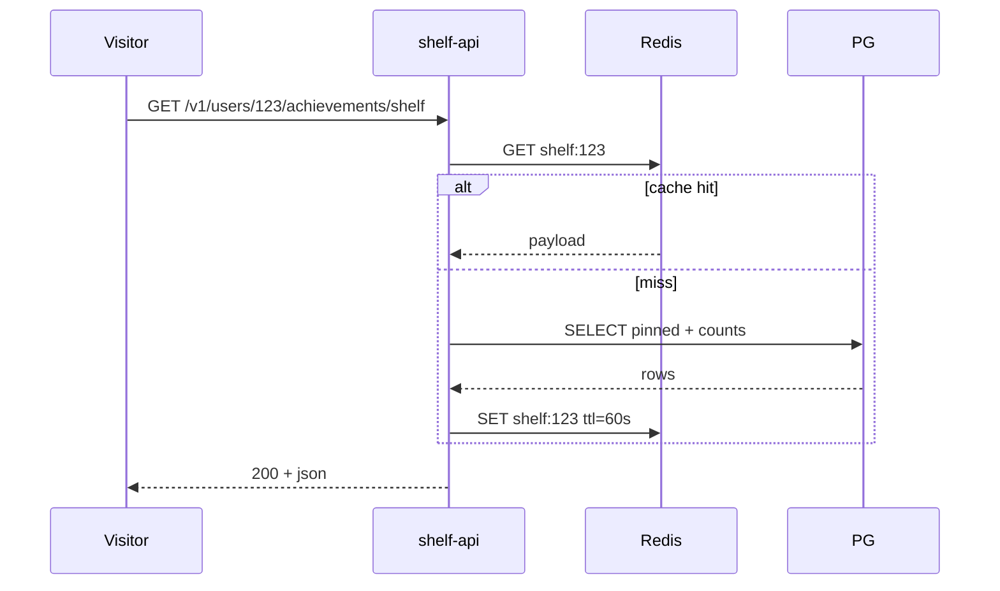

# Achievement System — App Flow

## Sequence: voice minute -> unlock



## Sequence: profile shelf load



## State machine: per-user achievement record

```
        +-------+    progress    +-----------+   threshold    +----------+
        | LOCKED| -------------> | IN_PROGRS | -------------> | UNLOCKED |
        +-------+                +-----------+                +----------+
            |                          |                            |
            | hidden flag              |                            |
            v                          |                            v
        +-------+                      |                      +----------+
        | HIDDEN| ---------------------+                      | PINNED   |
        +-------+    threshold         |                      +----------+
                    -> UNLOCKED         | progress reset (admin)
                                        v
                                   +-----------+
                                   | RESET     | (engineering only)
                                   +-----------+
```

## Edge cases

1. **Backfill on import.** When a user links a Steam account that brings 3 years of playtime, engine processes events with `silent=true`. Unlocks are inserted but pushes are suppressed; the next time the user opens the app, a single batched toast says "12 achievements unlocked while you were away. [View]".

2. **Concurrent threshold.** Two voice nodes report minute 6000 at the same instant. The INSERT into `user_achievements` uses `ON CONFLICT (user_id, achievement_id) DO NOTHING`, so only one row wins; the loser's NATS publish is skipped via the inserted-row-count check.

3. **Server-scoped + global same trigger.** A voice minute increments both global and per-server counters. Engine evaluates both sets; emits up to one toast per unlock.

4. **Achievement removed from rules.yaml.** Engine never deletes user rows. UI hides definitions not in the active catalog but exposes a `legacy=true` filter on the shelf for users who pinned them.

5. **Clock skew.** Events carry `occurred_at` from the producer. Engine trusts that for ordering only; thresholds check current counter, not timestamp.

6. **Rarity reset.** Nightly cron snapshots `unlocked_count / total_active_users`. If a previously-Legendary achievement crosses the 2% threshold, it stays Legendary for already-unlocked rows (rarity is denormalized at unlock time).

7. **User deletion.** Tombstone in `user_achievements` with `deleted_at`; shelf API filters them out. Counter rows hard-deleted.

8. **Shelf with deleted achievement.** Pin references gone; UI auto-replaces with the next-highest-rarity unlocked one and surfaces a one-time banner.

9. **Rate-limited unlock storms.** If a user crosses >5 thresholds in 30s (rare; usually backfill), engine collapses pushes into a single "5 achievements unlocked" toast.

10. **Idempotency key collision across users.** Keys are `{user_id}:{event_uuid}`; collision impossible by construction.
