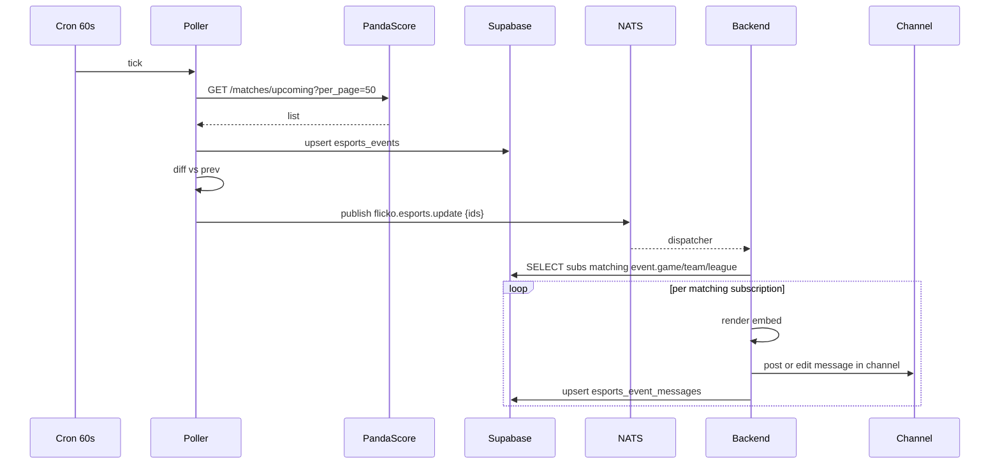

# Esports Integration — APPFLOW



## State Machine
```
event: [upcoming] → [live] → [finished]
                 \─→ [canceled]
subscription: [active] ⇄ [muted] (admin)
```

## Edge Cases
- Match postponed: status reverts to upcoming with new time; embed edited.
- Tournament rebracketing: new event row, old finished.
- Multiple subs for same match: post once per channel; edit single message.
- PandaScore inconsistency: check & trust local clock if mismatch.

## Background
- pg_cron 60s tick for live polling, 5m tick for upcoming.
- Schedule digest cron weekly Mon 09:00 server-local.

## Notifications
- "T1 just won game 2 vs GenG" message edit notification (channel-level).
- No global push by default.
