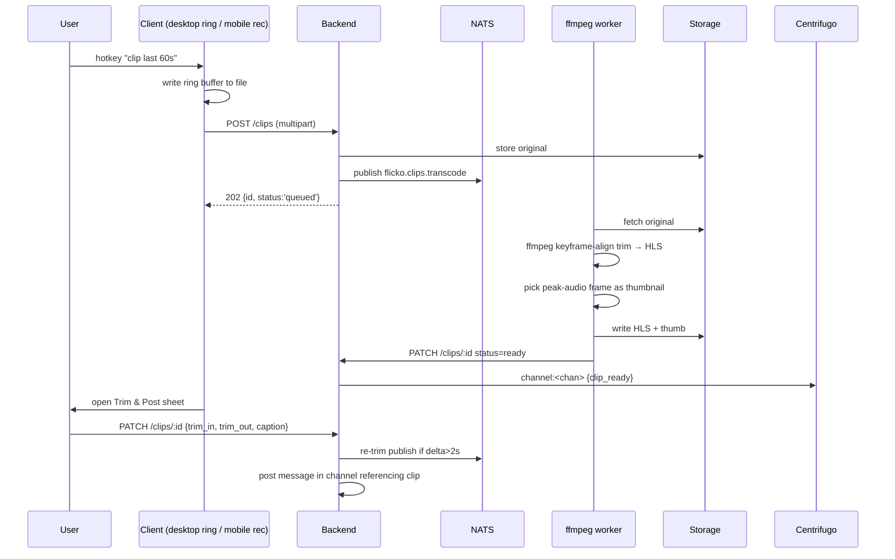

# Game Clip Sharing — APPFLOW



## State Machine
```
[capturing] → [uploaded] → [transcoding] → [ready] → [posted]
[any] → [blocked] (DMCA / NSFW)
[any] → [removed] (mod / author)
```

## Edge Cases
- No game detected: still allow, mark "Unknown".
- Mobile foreground app blocks recording: show fallback "Record screen via system → save to Flicko".
- Upload disconnect: Hive draft + tus-resumable.
- DMCA hit on audio fingerprint: block + author email.

## Background
- Cold-archive sweeper daily.
- Peak-audio thumb extracted async if first pass fails (silence).

## Notifications
- "alice clipped a play in #clips" → channel notification (not push by default).
