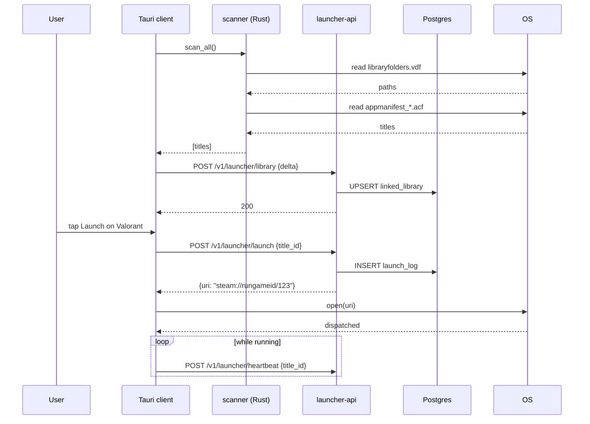
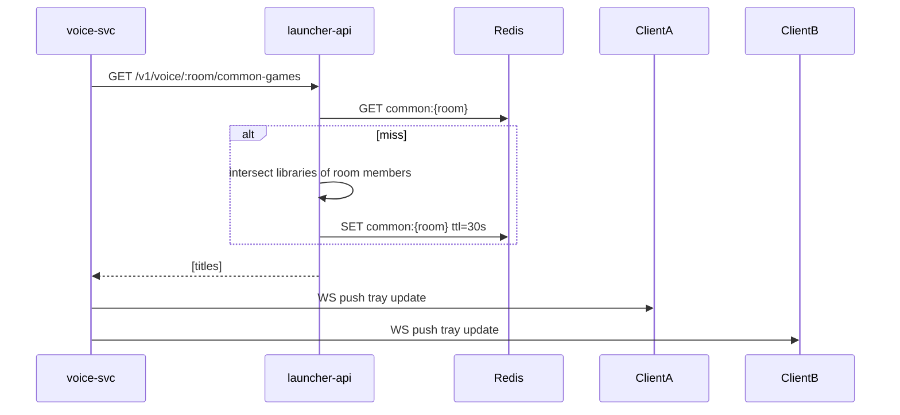

# Game Launcher — App Flow

## Sequence: scan + launch



## Sequence: voice quick-launch fan-out



## State machine: per-title detection state

```
   +---------+    scan finds   +-----------+   user hides    +---------+
   | UNKNOWN| --------------->| INSTALLED  |---------------->| HIDDEN  |
   +---------+                 +-----------+                 +---------+
                                    |                              |
                                    | scan misses 3x (uninstalled) | unhide
                                    v                              v
                              +-------------+               +-----------+
                              | UNINSTALLED |               | INSTALLED |
                              +-------------+               +-----------+
                                    |                              |
                                    | re-scan finds                |
                                    +----------> INSTALLED <-------+
```

## State machine: launch attempt

```
  IDLE -> CONFIRMING -> DISPATCHED -> RUNNING -> ENDED
                  |          |           |
                  |          v           v
                  |       FAILED      CRASHED
                  v
              CANCELED
```

## Edge cases

1. **Multiple Steam libraries.** `libraryfolders.vdf` lists 4 paths; scanner walks each. Dedupe by `appid`.

2. **Game installed but Steam offline.** URI dispatch still works; Steam launches into offline mode. Heartbeat may report nothing if Steam isn't running; we treat absence as "ended".

3. **User installs game during voice session.** Next 10-min scan picks it up; quick-launch tray updates within 30 s of cache TTL.

4. **Two desktops same user.** Each posts a delta; backend merges by union; uninstall requires both desktops to drop within 24 h before we mark uninstalled.

5. **URI dispatch fails on Linux** (no `xdg-open`). Show error with copy-to-clipboard fallback `steam://...`.

6. **Custom Steam install path.** `libraryfolders.vdf` is canonical; we never assume default install path.

7. **Path with non-ASCII chars.** Rust scanner uses `OsString`; payload posts as base64 if non-UTF-8. Backend stores canonical id only, never the path.

8. **GOG sqlite locked by Galaxy.** Open with `mode=ro` and `immutable=1`; on lock, retry with 1s backoff x3, then skip.

9. **User toggles privacy to Off.** Backend deletes `linked_library` rows for that user; cache invalidated; quick-launch tray for friends updates within 30 s.

10. **Mobile receives launch event from desktop friend.** UI shows non-clickable "Arjun is playing Apex"; if user taps it, opens store deep link not launch.

11. **Game has multiple appids** (Apex, ARK with DLCs). `game_titles` flattens by base id; appid -> canonical via lookup table.

12. **Anti-cheat denies running with overlay tools.** Flicko has no overlay; no interaction. We document "If your anti-cheat blocks Flicko, please report" in Help.
