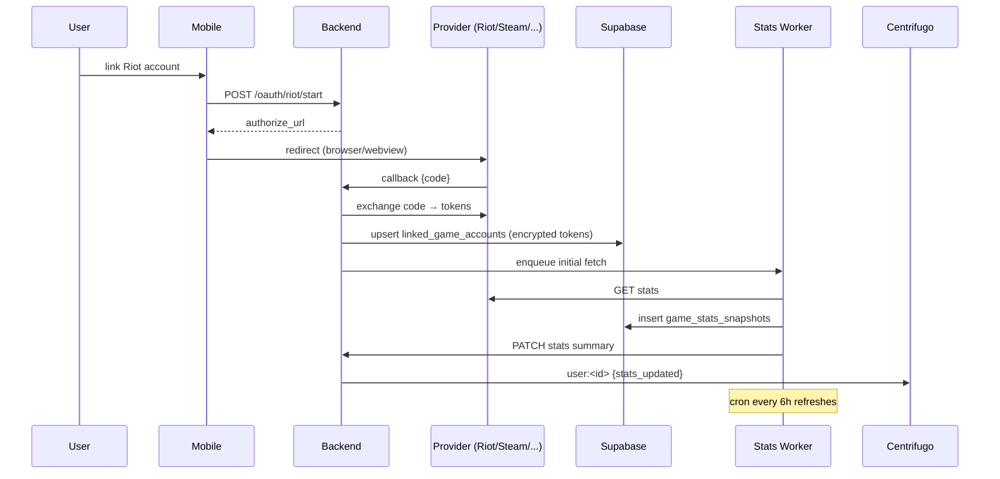

# Game Stats Integration — APPFLOW



## State Machine
```
account: [unlinked] → [linking] → [linked] → [refreshing] → [linked]
                              \→ [error] (re-prompt)
```

## Edge Cases
- Provider rate limit: serve cached, mark stale.
- Token revoked by user externally: detect on 401, re-prompt.
- Visibility = friends: only resolved when viewer is friend at request time.
- Profile lookup of disabled provider: hide section gracefully.

## Background
- pg_cron 6h refresh.
- Token rotation cron daily.
- Rank change → auto-grant/revoke roles per `rank_role_rules`.

## Notifications
- Optional: "You ranked up to Diamond III!" (user-toggle).
- Server-bot announcement: configurable.
