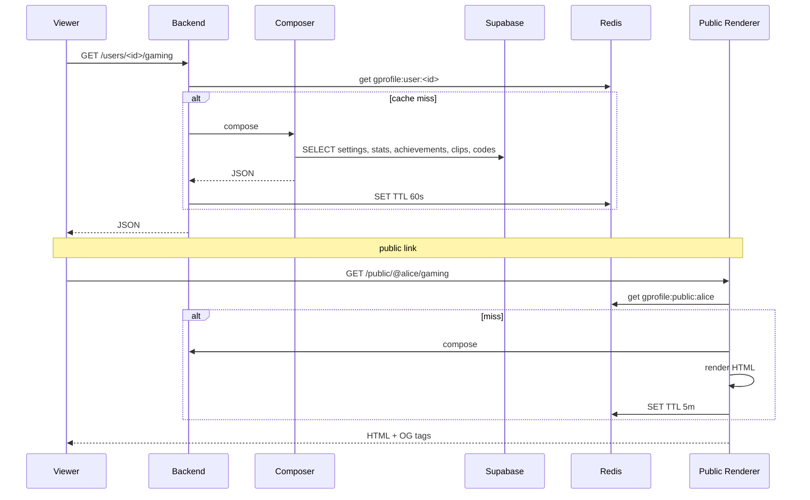

# Gaming Profiles Deep — APPFLOW



## State Machine
```
profile: [private] ⇄ [public]
section visible/hidden per section
```

## Edge Cases
- Slug already taken: suggest variants.
- User deletes account: public page returns 404 immediately (cache purge).
- Section provider disconnected: omit section gracefully.
- Image export fails: serve last successful card or generic.

## Background
- Cache invalidation on settings PATCH.
- Recent games refresher hooks into stats worker.

## Notifications
- None.
