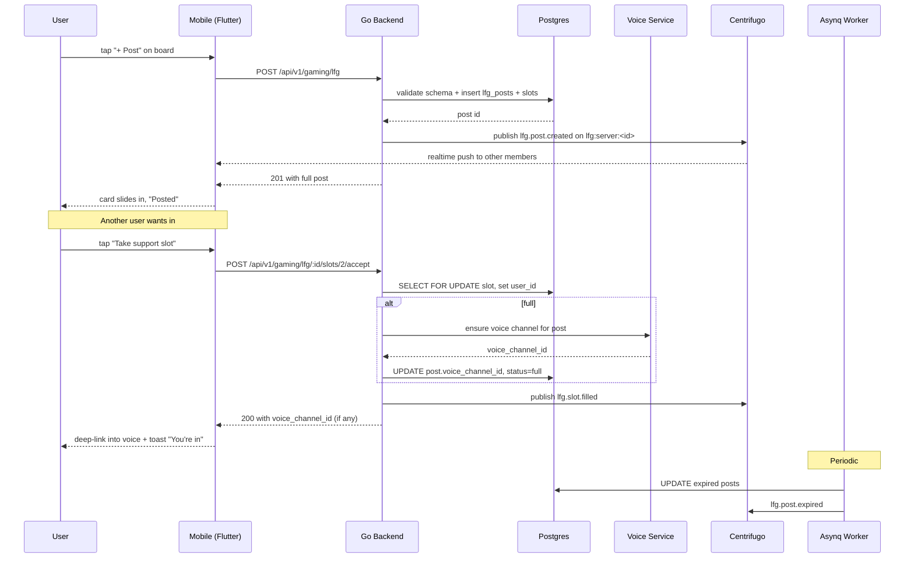

# LFG System — App Flow

## 1. End-to-End Journey



## 2. State Machine

```
[draft]      -- submit valid -->  [open]
[open]       -- slot.fill   -->   [open] (slots_filled++)
[open]       -- last slot   -->   [full]
[full]       -- voice idle  -->   [closed]
[open|full]  -- expires_at  -->   [expired]
[any]        -- author del  -->   [closed]
```

## 3. User Journeys

### J1 — Happy path (poster)
1. User opens gaming hub → LFG tab → taps "+ Post".
2. Selects VALORANT, picks "Competitive", rank Diamond–Immortal, region NA-East, mic required, 4 slots.
3. Submits. Card appears at top with their avatar in slot 1.
4. Within minutes, other users join. When 4/4, they're auto-deep-linked into a fresh voice channel.

### J2 — Happy path (joiner)
1. Browses board, filters by NA-East + Mic.
2. Sees riku's post, taps "Take support slot".
3. Slot lock acquires, server confirms, deep-link launches voice channel.
4. If they leave voice within 60s, slot is freed and post returns to `open`.

### J3 — Error path: slot taken between view and tap
1. User sees 1 open slot.
2. Taps "Take".
3. Server returns 409 Conflict.
4. UI replaces button with "Slot just taken. Find another." and refreshes list.

### J4 — Error path: validation
1. User submits post with rank_min above rank_max.
2. Backend rejects with 422 + per-field message.
3. Sheet highlights the bad field; user fixes; resubmits.

### J5 — Error path: rate-limited
1. User has posted 3 times this hour for VALORANT.
2. Submit returns 429.
3. UI shows "You've hit 3/hr. Try in 14 min." with countdown.

### J6 — First-time empty state
1. User on a server with no active posts.
2. Sees illustration + "No groups looking yet. Be the first." CTA.

## 4. Edge Cases

- Offline: queue create + accept actions in local outbox; replay on reconnect with idempotency key.
- Permission denied (server LFG disabled): hide "+ Post" button, show banner.
- Stale data: optimistic UI for slot accept; rollback on 409.
- Concurrent slot fills: row-level lock + redlock; loser sees "Slot just taken".
- Author leaves: post stays open, slot 0 frees; if 0 slots filled, post auto-closes.
- Rate limit hit: token-bucket backoff + UI hint.
- Network slow: optimistic card insertion with "Posting…" badge until ack or 5s timeout.
- Voice service degraded: post still creates; "Join voice" CTA shows "preparing channel" until ready.
- Cross-server post on a non-opted server: hidden from hub; visible only to server members.

## 5. Background / Async

- **Expirer worker (asynq cron):** every 60s, sweep `lfg_posts WHERE status='open' AND expires_at < now()`.
- **Idle voice cleaner:** every 5min, close voice channels with 0 members for 5min and post status to `closed`.
- **Cross-server hub indexer:** debounced 2s after post create, push to Meilisearch `lfg_posts`.
- **Idempotency key:** `lfg:create:<user_id>:<sha1(payload)>` cached 60s in Redis.
- **Failure policy:** retry 3× with exponential backoff (1s/4s/16s), then DLQ + Sentry alert.

## 6. Notifications

- **Trigger:** post slot filled OR post about to expire (10min warning).
- **Channels:** in-app toast + push (low-priority) for slot fills; in-app only for expiry warnings.
- **Copy:**
  - Slot fill: "@kai joined your VALORANT group. 3/4 filled."
  - Full: "Your group is full. Voice is ready."
  - Expiry: "Your post expires in 10 minutes. Extend?"
- **Deep link:** `flicko://lfg/post/<id>`.
- **Batching:** max 1 push per post per 60s.
- **Quiet hours:** respect user notification settings; never push between 23:00–07:00 local unless user opted in.
