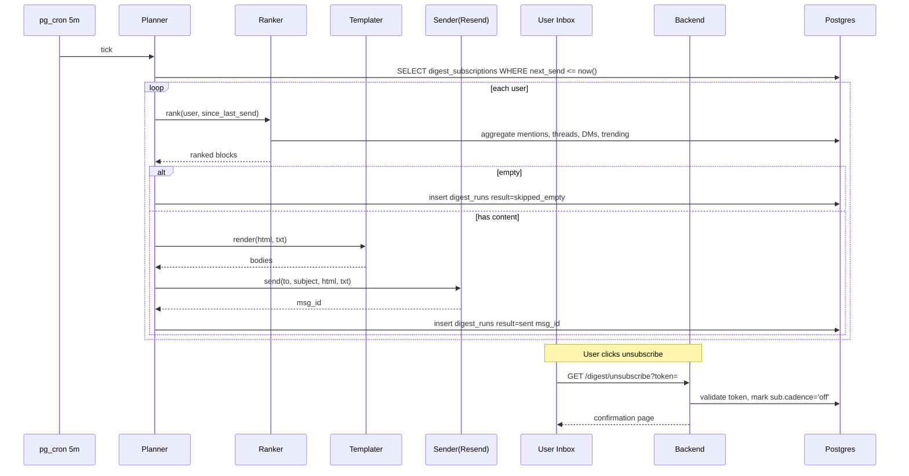

# Email Digest — App Flow

## 1. End-to-End Journey



## 2. State Machine

```
subscription:
  [off] -- enable --> [active]
  [active] -- pause via bounce --> [paused]
  [active] -- complaint --> [suppressed]
  [paused] -- user reactivates --> [active]
  [suppressed] -- (terminal until ticket) --> [suppressed]

per-run:
  [planned] -- rendered ok --> [sent]
  [planned] -- empty --> [skipped_empty]
  [planned] -- send error --> [failed]
```

## 3. User Journeys

### J1 — First-time enable
1. New user opens Settings -> Notifications -> Email digest.
2. Picks "Weekly Mondays 9 AM" in their tz.
3. Server allowlist defaults to all unmuted; user excludes 1 noisy server.
4. Saves. Toast "First digest arrives Monday 9 AM."

### J2 — Send and read
1. Cron fires Monday 9 AM (in user tz).
2. Planner selects user; ranker collects content from past 7 days.
3. Templater renders HTML + plain text.
4. Sender hits Resend. Email arrives.
5. User clicks a thread link -> opens in app.

### J3 — Unsubscribe one-click
1. User clicks "Unsubscribe" in Apple Mail.
2. Browser opens `/u/<token>`; cadence set to `off`; confirmation shown.
3. User can re-enable in app any time.

### J4 — Empty digest
1. User has had no activity this week.
2. Planner skips with `skipped_empty`.
3. No email sent; metric incremented.

### J5 — First-time empty state in preferences
1. New user sees toggle off; helpful subtitle "We'll only send what you'd care about."

## 4. Edge Cases

- **Recipient muted source server:** excluded by default unless allowlisted.
- **DM snippets:** include only if the recipient is a participant.
- **Long thread:** include first 200 chars + "Read more".
- **Locale unknown:** English fallback.
- **DST shift:** schedule recomputed at each tick.
- **Bouncing email:** pause subscription; in-app warning to update email.
- **Hard cap on size:** strip lowest-ranked blocks if email > 100 KB.

## 5. Background / Async

- Planner cron: every 5 min
- Ranker is read-only against materialized message stats
- Sender uses Resend with retry 3x / exponential backoff
- Cleanup cron: daily, prune `digest_runs` older than 90d

## 6. Notifications

| Trigger | Channel | Copy | Deep link | Batching |
|---------|---------|------|-----------|----------|
| Hard bounce | in-app | "Couldn't deliver your digest. Update email?" | settings | once per state change |
| Spam complaint | in-app | "Your digest is paused per our spam policy." | settings | once |
| First send confirmed | in-app | "Your first digest is on its way!" | settings | once |

Voice: friendly, owner-only, never promotional.
