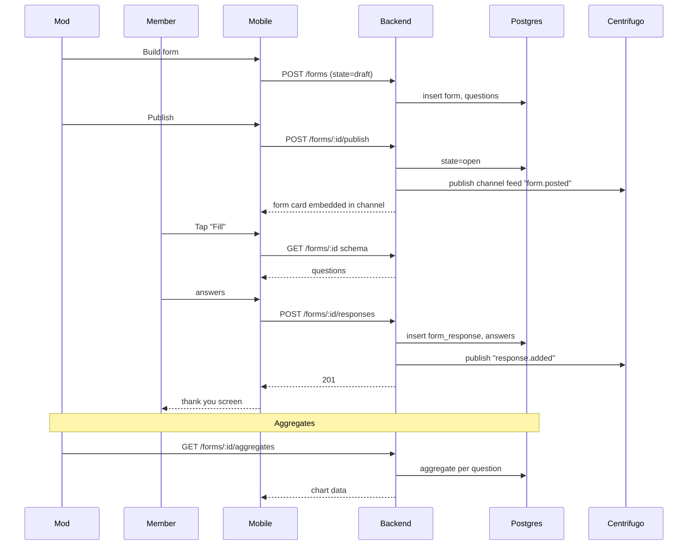

# Forms & Surveys — App Flow

## 1. End-to-End Journey



## 2. State Machine

```
form: [draft] -- publish --> [open]
[open] -- close (manual or closes_at) --> [closed]
[closed] -- archive --> [archived]

per-user response:
  [none] -- submit --> [submitted]
  [submitted] -- limit_one + retry --> [rejected]
```

## 3. User Journeys

### J1 — Build and publish
1. Mod taps "+ Form" in channel.
2. Builder shows blank canvas with 1 starter question.
3. Adds questions; reorders; previews.
4. Sets "Anonymous" + "Closes Friday".
5. Publishes; channel shows a card with "Fill (2 min)".

### J2 — Member fills
1. Member taps "Fill".
2. Linear walkthrough; progress dots.
3. Submits; thank-you screen with optional share.

### J3 — Mod reviews
1. Mod opens form -> Responses.
2. Aggregates: pie for choice questions, bar for scale, sample text replies.
3. Exports CSV.

### J4 — Late respond
1. After close, "Fill" disabled with explanation.

### J5 — First-time empty state
1. Server -> Forms tab empty.
2. Illustration + "Build a form to collect feedback".

## 4. Edge Cases

- Schema edit after open: only labels and order; new questions blocked.
- Network drop mid-fill: drafts cached locally.
- Rate limit: 60 submits/hour per user across all forms.
- File too big: 413 with helpful copy.
- Mod views own anonymous responses: still sees as "Anonymous".

## 5. Background / Async

- Auto-close cron at `closes_at`
- Aggregate cache invalidation on response insert
- CSV stream uses cursor-based pagination

## 6. Notifications

| Trigger | Channel | Copy | Deep link | Batching |
|---------|---------|------|-----------|----------|
| Form published | bot post in channel | "{title} — quick {n}-question form" | form fill | once |
| Form closing soon | in-app | "Form '{title}' closes in 24h" | fill | once |
| Mod gets aggregate ready (>10 responses) | in-app | "First 10 responses on '{title}'" | aggregates | once per threshold |

Voice: friendly.
