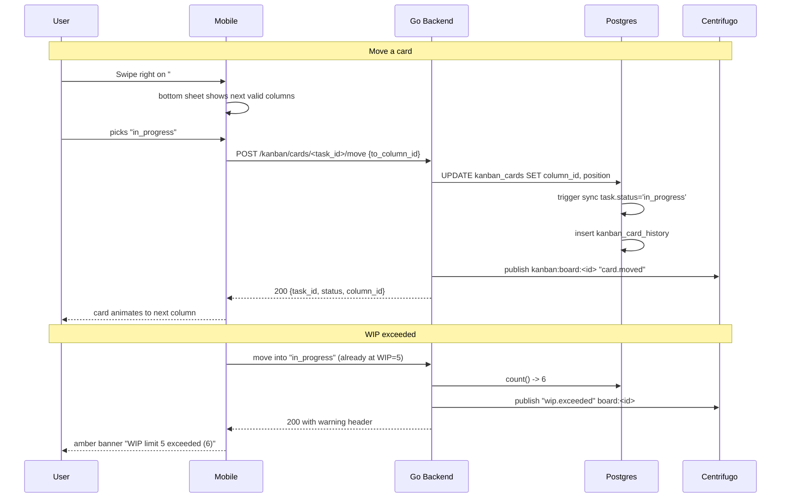

# Kanban Boards — App Flow

## 1. End-to-End Journey



## 2. State Machine

```
column wip:
  [under_limit] -- cards++ exceeds limit --> [over_limit]
  [over_limit]  -- cards-- below limit  --> [under_limit]

board lifecycle:
  [active] -- archive --> [archived]
  [archived] -- restore --> [active]
  [archived] -- 60d --> [purged]
```

## 3. User Journeys

### J1 — First board setup
1. Owner opens server -> Boards -> "+ New board".
2. Wizard: name "Q3 Roadmap", template "Default 5-column".
3. Board created with To do, In progress, Blocked, Done, Cancelled.
4. Existing tasks auto-grouped into columns by their current status.
5. Owner sets WIP limit on "In progress" -> 5.

### J2 — Daily standup view
1. Lead opens board, filters to "Mine".
2. Sees their own 4 cards across columns.
3. Swipes one from "in progress" to "review" (custom status mapped to done -- not in v1; using fixed status).

### J3 — Drag from done to wrong column
1. Member drags a Done card back to To do (could be intentional reopen).
2. App confirms "Move done card back to To do?".
3. On confirm, status reverts; activity log entry "@user reopened #142".

### J4 — Stuck card nudge
1. Cron runs nightly; finds cards in same column for 14d.
2. Bot posts in source channel: "@assignee, '#142 Triage crash' has been in In Progress for 14d. Anything blocking?"
3. Assignee can reply or move card.

### J5 — First-time empty state
1. Server -> Boards: empty.
2. Illustration of post-it notes; copy "No boards yet".
3. CTA "+ Create board" + template options.

## 4. Edge Cases

- **Concurrent moves:** server resolves with last-write-wins on column change; positions rebalanced.
- **Column delete with cards:** blocked unless empty or `force=true`.
- **WIP soft warning:** never blocks a move; logs and emits realtime event.
- **Filter mismatch on incoming card:** card hidden until filter cleared; banner "1 hidden card".
- **Realtime drop:** client uses ETag on next state fetch.
- **Phone reachable column:** swipe target sheet always shows allowed transitions; previous-status arrow available.

## 5. Background / Async

- **Stuck-card detector:**
  - cron nightly 03:00 UTC
  - selects cards `WHERE last_moved_at < now()-interval '14 days' AND column.status_map IN ('in_progress','blocked')`
  - emits one nudge per card per 7-day window
- **Position rebalancer:**
  - on save, if positions float-collide, normalize column to integer steps

## 6. Notifications

| Trigger | Channel | Copy | Deep link | Batching |
|---------|---------|------|-----------|----------|
| Card assigned via board | in-app + push | "Assigned: '{title}' on {board}" | `flicko://board/<id>/card/<task>` | 1 per actor 5m |
| WIP exceeded | in-app | "{column} is over WIP ({n}/{limit})" | board | once per board per hour |
| Stuck-card nudge | bot post | "Anything blocking on #{n}?" | task detail | once per 7d |
| Board archived | in-app | "{board} was archived" | server boards list | once |

Voice: short, action-friendly.
