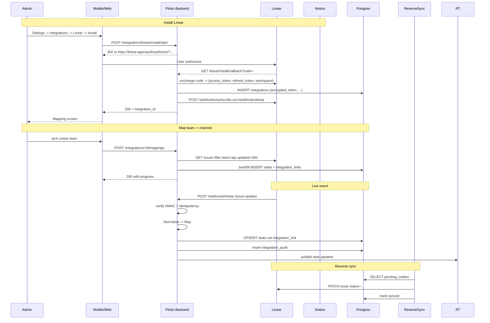

# Notion / Linear Integration — App Flow

## 1. End-to-End Journey



## 2. State Machine

```
connector:
  [active] -- token expired & refresh fail --> [needs_reinstall]
  [active] -- admin disable --> [paused]
  [paused] -- enable --> [active]
  [active] -- uninstall --> [removed]

per-mapping link:
  [linked] -- external delete --> [orphan]
  [linked] -- flicko archive --> [linked but hidden]
  [orphan] -- restore link --> [linked]
```

## 3. User Journeys

### J1 — Connect Linear and map a team
1. Admin opens Settings -> Integrations -> Linear -> Install.
2. OAuth dialog opens; admin authorizes.
3. Returns to Flicko mapping screen; picks team "api" -> channel "#engineering".
4. Backfill runs; tasks appear in #engineering and on board if linked.
5. Admin sees progress 0% -> 100%.

### J2 — Status change in Linear reflects in Flicko
1. PM moves Linear issue to "In Progress".
2. Webhook fires; Flicko updates corresponding task to status `in_progress`.
3. Bot posts a thread reply in #engineering: "Linear: APP-23 -> In Progress".

### J3 — Status change in Flicko reflects in Linear
1. Engineer marks Flicko task done.
2. ReverseSyncWorker batches updates every 30s.
3. Linear issue closed; Flicko task gets a sync timestamp.

### J4 — Notion DB sync (poll-based)
1. Admin connects Notion; picks "Roadmap" DB filter "Status != Archived" -> #planning.
2. Notion poller runs every 5 min; webhook fires on page edit.
3. New rows appear as tasks; status changes propagate.

### J5 — Token expires
1. Refresh token returns 401.
2. Connector enters `needs_reinstall`; banner in Settings; sync paused.
3. Admin reinstalls; sync resumes from last cursor.

## 4. Edge Cases

- **Cycle:** Flicko -> Linear -> webhook returns to Flicko. Idempotency key blocks re-apply.
- **Bulk import:** rate-limit ingestion to 50/s; backfill marked as priority=low.
- **Filter changed mid-sync:** snapshot filter at mapping create; admin must re-confirm to switch.
- **Linear assignee not in Flicko server:** create unassigned task with note.
- **Webhook out-of-order:** events carry `updated_at`; ignore if older than current task `updated_at`.
- **Encrypted token DB read failure:** retry; on persistent failure mark needs_reinstall.

## 5. Background / Async

- Notion poller: 5 min for each connected DB
- ReverseSyncWorker: 30s tick batching outbox
- Token refresh: hourly check; refresh anything within 1h of expiry
- Health monitor: hourly; webhook delivery rate < 95% triggers alert

## 6. Notifications

| Trigger | Channel | Copy | Deep link | Batching |
|---------|---------|------|-----------|----------|
| Connector installed | bot post in #integrations | "Linear connected. {n} items synced." | Settings -> Integrations | once |
| Sync error spike | DM admin | "Linear sync errors: {n}. Investigating." | Settings | hourly |
| Token needs re-install | DM admin | "Linear connection expired. Re-install in Settings." | Settings | once per state change |
| Conflict (external wins) | thread reply on task | "Conflicting change resolved by Linear." | task | once per conflict |

Voice: factual, admin-targeted.
