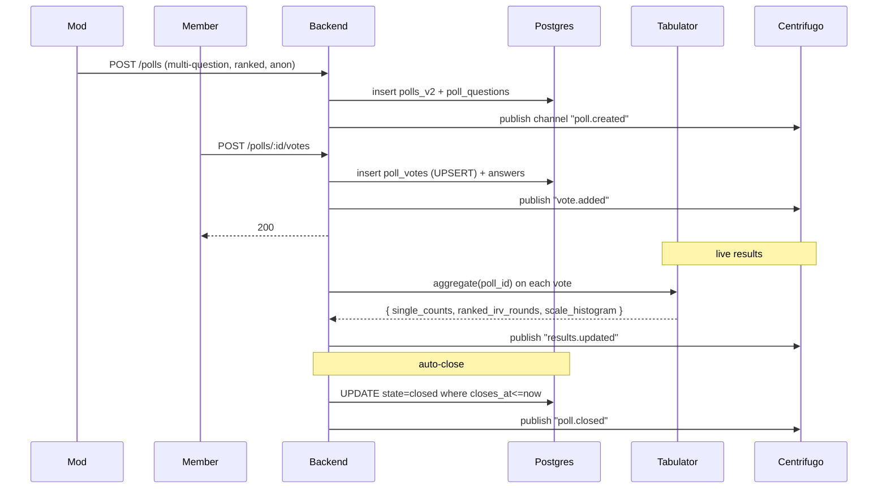

# Rich Polls — App Flow

## 1. End-to-End Journey



## 2. State Machine

```
[draft] -- publish --> [open]
[open] -- closes_at OR mod close --> [closed]
[closed] -- archive --> [archived]

per-vote:
[none] -- submit --> [recorded]
[recorded] -- retract (if allowed) --> [none]
```

## 3. User Journeys

### J1 — Ranked-choice poll
1. Mod composes 4 options for movie night, picks "ranked".
2. Members rank options.
3. Live results show round-by-round IRV elimination.
4. Closes at Friday 8pm; final winner announced.

### J2 — Anonymous opinion poll
1. Mod creates anon poll about server policy.
2. Members vote without identity.
3. Mod can see counts but never who voted.

### J3 — Multi-question
1. Mod combines: pick day, pick activity, scale "how important".
2. Member submits all in one screen.
3. Aggregates show three charts.

### J4 — First-time empty state in compose
1. Member taps Poll in compose.
2. Empty wizard with question type cards; "Pick a poll type to start".

### J5 — Late voter
1. After close, vote button disabled.
2. Banner: "This poll ended {when}. See results."

## 4. Edge Cases

- **Schema edit after votes:** disallowed; mods see locked icon.
- **Tied IRV result:** alphabetical tiebreak; UI shows Tie label.
- **Bot voting:** require account age >24h; rate limit 30 votes/min.
- **Network drop mid-vote:** local cache; resubmit on reconnect; UNIQUE prevents dupe.
- **Anon mode + retract:** allowed; salt-hash lookup.
- **Mass options (>20):** capped at 20 per question.

## 5. Background / Async

- Auto-close cron every minute
- Aggregate cache invalidate on each vote
- Tabulator runs IRV in-memory; cached 5s
- Old anon hashes purged after 90d (only the index, raw votes stay)

## 6. Notifications

| Trigger | Channel | Copy | Deep link | Batching |
|---------|---------|------|-----------|----------|
| Poll posted | bot post | "{title}" | poll | once |
| 1h to close | in-app | "Poll closes in 1 hour" | poll | once |
| Closed result | in-app | "{title}: {winner}" | poll | once |
| Mention in poll question | in-app | "@author mentioned you" | poll | once |

Voice: short.
