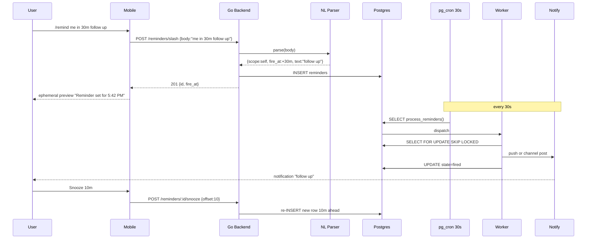

# Reminders — App Flow

## 1. End-to-End Journey



## 2. State Machine

```
[pending] -- worker --> [firing]
[firing] -- ok --> [fired]
[firing] -- transient err --> [pending] (attempt++)
[firing] -- permanent err --> [failed]
[pending] -- cancel --> [cancelled]
[fired] -- snooze --> creates new [pending]
```

## 3. User Journeys

### J1 — Personal reminder
1. User types `/remind me in 1h drink water`.
2. Inline preview chip shows time and snooze.
3. Pushes Send (or auto-confirms on Enter).
4. Reminder fires; push tap opens in-app banner with Done/Snooze.

### J2 — Channel reminder
1. Mod types `/remind #standup every weekday 9am post your update`.
2. Confirmation chip with calendar icon shows recurrence.
3. At 9am each weekday, bot posts text in #standup.
4. Mod can `/remind list` to see all and cancel any.

### J3 — Ambiguous parse
1. User types `/remind me later about taxes`.
2. Backend can't bind "later"; returns suggestions: "in 1 hour", "tomorrow 9am", "friday 9am".
3. User taps a chip; reminder set.

### J4 — Permission revoked
1. Channel reminder due at 9am; mod no longer in server.
2. Worker fails channel write; falls back to DM to setter: "Couldn't post in #standup".

### J5 — First-time empty state on list
1. `/remind list` with none -> "No active reminders".

## 4. Edge Cases

- **Empty text:** parser allows but UI nudges to add text.
- **Fire in the past:** API returns 400 with hint "fire time is in the past".
- **DST transition:** stored tz wins; recurrence reanchors per day.
- **Mass set:** quota 100 active per user.
- **Channel deleted before fire:** mark `failed_chan_gone`, DM setter.
- **User left server:** keep reminder if scope=self; cancel if scope=channel.

## 5. Background / Async

- Worker tick: 30s, lock-skip claim
- Idempotency by row state
- Recurrence next-occurrence inserted on success
- Failure retries 3x before `failed`

## 6. Notifications

| Trigger | Channel | Copy | Deep link | Batching |
|---------|---------|------|-----------|----------|
| Self reminder fire | push | "{text}" | `flicko://reminder/<id>` | none |
| Channel reminder | channel msg | "{text}\n_Set by @user_" | inline | none |
| DM reminder | DM | "{text}\n_Reminder set by @setter_" | DM | none |
| Failed permission | DM to setter | "Couldn't post in {channel}" | reminders list | once |

Voice: short, friendly, second-person.
