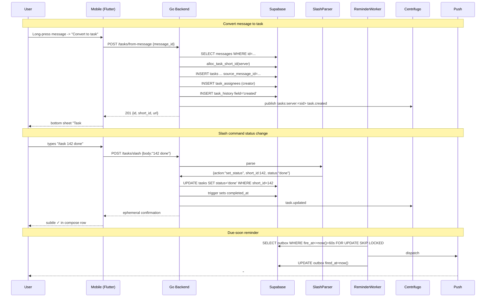

# Task Management — App Flow

## 1. End-to-End Journey



## 2. State Machine

```
task status:
  [todo] -- start work --> [in_progress]
  [in_progress] -- block --> [blocked]
  [blocked] -- unblock --> [in_progress]
  [todo|in_progress|blocked] -- done --> [done]
  [todo|in_progress|blocked|done] -- cancel --> [cancelled]
  any -- archive --> [archived (soft)]
```

## 3. User Journeys

### J1 — Mod converts a bug-report message
1. Member posts "App crashes on Android 12 when uploading >10MB image".
2. Mod long-presses the message.
3. Sheet appears with primary action "Convert to task".
4. Pre-filled: title from first 80 chars, description from full body.
5. Mod adjusts title, picks assignee @dev_priya, due Friday 5pm, label "bug".
6. Saves; toast "Task #142 created. @dev_priya notified."
7. Original message gets a small "Linked to #142" chip below.

### J2 — Member checks their inbox
1. Member taps profile -> "My tasks".
2. Sees grouped: Overdue (red), Due today (orange), Upcoming, No due.
3. Taps a task -> detail screen with comments, assignees, status pill.
4. Updates status to in_progress; @creator gets a subtle in-app notification.

### J3 — Slash command status flip
1. Member types `/task 142 done` in any channel they belong to.
2. Inline preview shows resolved task title; Enter sends.
3. Status changes; ephemeral toast confirms; task disappears from open inbox.

### J4 — First-time empty state
1. New server -> Tasks tab.
2. Empty illustration: clipboard with checkmark.
3. Copy: "No tasks yet. Pin work that matters here."
4. CTA: "+ New task" + "Try /task new in any channel".

### J5 — Assignee no longer in server
1. Mod opens task; assignee chip shows "Former member" tooltip.
2. Mod taps "Reassign" -> picks new assignee; old chip removed.
3. History records `assignee.removed` and `assignee.added`.

## 4. Edge Cases

- **Offline create:** local pending state with clock icon; queued POST.
- **Permission denied:** members can't archive others' tasks; archive button hidden.
- **Stale read:** ETag on detail; 412 -> client refetches and retries.
- **Concurrent edits:** last-write-wins on simple fields; comments append-only.
- **Slash parse ambiguity:** `/task done` without ID fails with help text.
- **Massive description:** capped at 8000 chars; client warns at 7500.
- **Label deleted while in use:** RESTRICT with friendly error; UI removes from chip; deletion cascades only via DB CASCADE on label_links.
- **Network slow:** optimistic UI on status flips; rollback on failure with snackbar.

## 5. Background / Async

- **Reminder dispatch (`due_soon` 60min before, `overdue` 5min after):**
  - Triggered by: pg_cron `task_reminder_tick` every minute
  - Idempotency: UNIQUE on (task_id,user_id,kind)
  - Failure: retry 3 with backoff 30s/2m/10m; then DLQ
- **Stale-task nudge:**
  - Weekly cron: any task in `in_progress` for 14d without comment -> bot post in source channel
- **Archive purge:**
  - Daily: delete rows with `archived_at < now() - interval '30 days'`

## 6. Notifications

| Trigger | Channel | Copy | Deep link | Batching |
|---------|---------|------|-----------|----------|
| Assigned to you | in-app + push | "@{actor} assigned you #{n}: {title}" | `flicko://server/<sid>/task/<n>` | 1 per actor per 5m |
| Comment on your task | in-app | "@{actor}: {body[0..80]}" | same | once per comment |
| Due soon (T-60m) | push | "#{n} due in 1 hour" | same | once |
| Overdue | push | "#{n} is overdue" | same | once per task |
| Status -> done by other | in-app | "@{actor} marked #{n} done" | same | once |
| Stale nudge | bot post in channel | "@assignee any update on #{n}?" | same | weekly cap |

Voice: friendly, second-person, short. Always include short_id `#142` for grep-ability.
