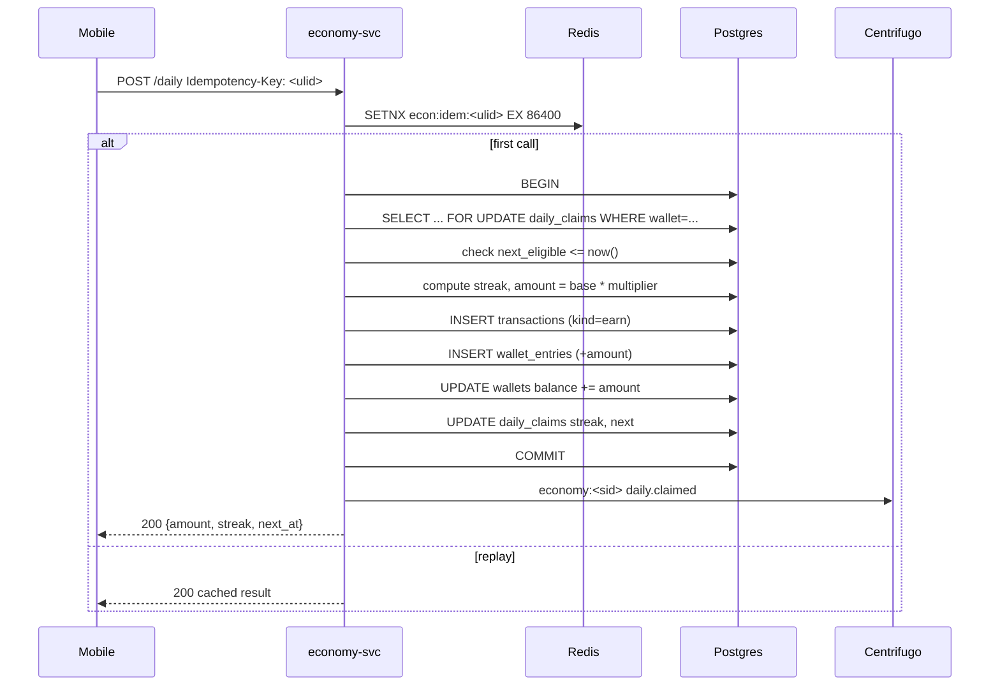

# Server Economy — App Flow

## 1. End-to-End Journey — Earn from message

```mermaid
sequenceDiagram
    participant U as User (sends msg)
    participant CHAT as chat-svc
    participant NATS as NATS jetstream
    participant EARN as earn-worker
    participant REDIS as Redis (velocity)
    participant DB as Postgres
    participant RT as Centrifugo
    participant M as Mobile

    U->>CHAT: send message
    CHAT->>NATS: publish flicko.economy.earn.msg {wallet_id, amount=1, ref=msg_id}
    EARN->>REDIS: INCRBY econ:velocity:msg:<wid>:<hour>
    alt under cap
      EARN->>DB: BEGIN; SELECT FOR UPDATE wallet; INSERT entry; UPDATE wallet.balance; COMMIT
      EARN->>RT: publish economy:<sid> balance.updated
      RT-->>M: push
    else over cap
      EARN->>DB: INSERT audit row reason=velocity_blocked
    end
```

## 2. End-to-End Journey — Daily claim



## 3. State Machine (claim button)

```
[idle:eligible] -- tap --> [submitting]
[submitting]  -- 200 ok --> [claimed:cooling]
[submitting]  -- 409 already claimed --> [claimed:cooling]
[submitting]  -- 5xx --> [error] -- retry --> [submitting]
[claimed:cooling] -- next_at reached --> [idle:eligible]
```

## 4. User Journeys

### J1 — Member earns and claims

1. Member opens server, header shows "Stardust 1,205".
2. Daily card glows; tap claim.
3. Optimistic UI: balance counts up by predicted amount.
4. On 200, shows "+25 (streak x4)". On error, balance reverts and toast appears.
5. Realtime push refreshes server-wide leaderboard widget.

### J2 — Admin enables economy

1. Settings > Economy > "Turn on".
2. Pick name "Stardust", upload icon, choose starting balance 100, choose TZ.
3. Save -> backend creates `currency_config` + provisions wallets for all members in batches of 1000 via background job.
4. UI shows "Provisioning 14,210 wallets ~ 30s" progress with realtime updates.
5. On done, leaderboard available.

### J3 — Mod grants coins

1. Mod opens member profile -> Wallet tab.
2. Tap Mod actions -> Grant.
3. Enter amount + reason (required, >=10 chars).
4. Confirm; UI shows MFA challenge if amount > 10,000.
5. Audit row appears in mod log; member sees push "You received 500 Stardust from @mod (reason)".

### J4 — Fraud / freeze

1. Anti-fraud worker flags wallet (sudden 50x earn vs trailing 7d avg).
2. Wallet auto-frozen; member sees red banner "Wallet under review".
3. Mod reviews audit, unfreezes or revokes; either action emits `wallet.frozen` event.

## 5. Edge Cases

- Offline: claim button disabled; queued claim only allowed if Idempotency-Key persisted locally; retried on reconnect.
- Permission denied (banned member): wallet read returns 403 with `frozen=true` status; UI shows neutral message, never the underlying reason.
- Stale data: client always trusts the realtime push. On conflict, server version wins (compare `wallets.version`).
- Concurrent claim attempts (2 devices): row-level lock + idempotency key serialize; one succeeds, the other gets cached identical result.
- Rate limit: 429 with `Retry-After`; UI shows soft toast.
- Currency rename mid-session: client subscribes to `currency.updated`; balance card swaps name + icon with crossfade.

## 6. Background / Async

- **earn-worker**
  - Trigger: NATS subjects `flicko.economy.earn.{msg,voice,reaction,custom}`.
  - Idempotency key: `<source>:<ref_id>` (e.g. `msg:<message_id>`).
  - Failure: durable consumer; retry 5x exp backoff up to 5min then DLQ.
- **daily-eligibility-worker**
  - Cron: server-tz `0 0 * * *` (rolling per shard, batched).
  - Idempotency: `daily:<server_id>:<date>`.
- **reconciliation-worker**
  - Cron: `0 3 * * *` UTC, runs `SELECT SUM(signed_amount) ... GROUP BY wallet_id` and compares to `wallets.balance`.
  - On drift: alert PagerDuty severity-1.
- **provisioning-worker**
  - Trigger: NATS `flicko.economy.provision.<server_id>` when admin first enables.
  - Batch size: 1000 wallets per tx; resume from last offset on crash.

## 7. Notifications

- Trigger event: `daily.claimed` (digest, optional), `wallet.frozen` (push, in-app), `mod.grant` (push if amount > 0), `streak.broken` (in-app, optional).
- Channels: push (FCM), in-app (Centrifugo), email (digest only).
- Copy:
  - Daily reminder push: `"Your daily Stardust is ready"` (24h after last claim, only if streak > 1).
  - Mod grant: `"@mod gave you 500 Stardust"`.
- Deep link: `flicko://server/<server_id>/wallet`.
- Batching: max 1 economy push per user per 30 min; daily reminder once per UTC day.
