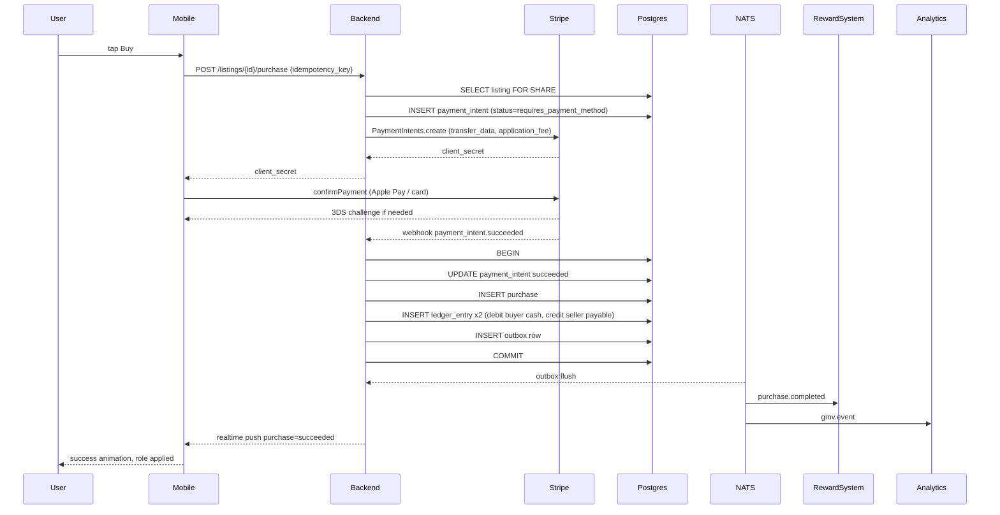

# APPFLOW - Server Marketplace

## Sequence: Fixed-price purchase happy path


## State Machine: payment_intent
```
        created
           |
           v
   requires_payment_method
           |   confirm
           v
      processing
       /        \
 succeeded   payment_failed
      |          |
      v          v
  finalized   abandoned (15 min)
      |
      v
  refund_requested -> refunded
      |
      v
  disputed -> dispute_won | dispute_lost
```

## State Machine: auction listing
```
   draft -> live -> ending_soon -> ended_pending_payment -> sold
                          ^                |
                          |                v
                       extend (snipe)   payment_failed -> back to top bidder n-1
                                            |
                                            v
                                          unsold (after all bidders fail)
```

## Edge Cases
- **Webhook before client confirm response**: Stripe webhook can land before mobile receives confirm result. We rely on webhook as source of truth; client UI listens to Realtime channel `purchase:{id}` for final state, never trusts client confirm response alone.
- **Dual webhook delivery**: handled by `stripe_events.event_id` UNIQUE; second insert hits ON CONFLICT DO NOTHING and dispatch is short-circuited.
- **Refund initiated then dispute filed**: refund freezes listing; if dispute filed after refund, accept dispute as won by default (Stripe network rule), no double-reversal because ledger checks `existing_reversal_id IS NULL` before writing.
- **Auction tie**: if two bids land in same ms (rare, behind redis ZADD lock), tiebreaker is bid `id` ULID lexicographic order, lower wins.
- **Race - listing edited mid-purchase**: purchase pins `listing_version`; if version changed when intent finalizes, we still honor original price (snapshot stored in payment_intent row).
- **Connect account de-platformed**: Stripe sends `account.updated capabilities=disabled`. We pause new listings, allow existing intents to finalize, queue payouts manually.
- **KYC tier crossed mid-month**: when seller GMV crosses $1k lifetime, we require enhanced KYC, gate further publishes, but do not interrupt in-flight purchases.
- **Refund after seller cashed out**: covered by negative balance on Connect account; if Connect insufficient, debit Flicko platform reserve and add seller debt row, surface in seller dashboard.
- **Idempotency replay with different body**: server compares hash of body to stored hash; mismatch returns HTTP 409 with original response.
- **Apple/Google Pay disagreement on currency**: backend rejects intent if presentment_currency != listing.currency, forces re-quote.
