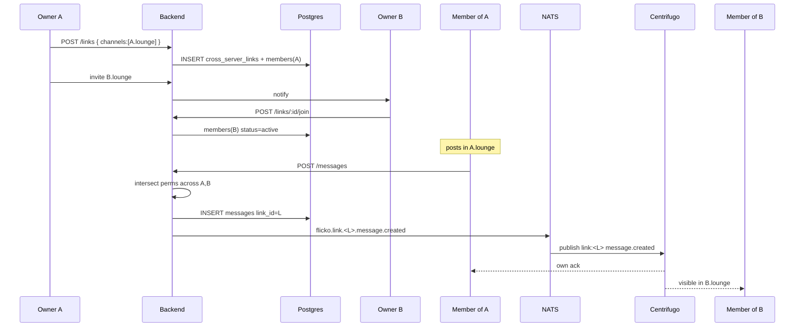

# Cross-Server Channels — App Flow

## 1. End-to-End Journey



## 2. State Machine

```
Link:
[proposed] -- accept --> [active]
[active]   -- pause   --> [paused]
[paused]   -- resume  --> [active]
[active]   -- last member leaves --> [dissolved]
[active]   -- explicit dissolve --> [dissolved]

Channel-in-link:
[pending] -- accept --> [active]
[active]  -- leave  --> [left]
[active]  -- removed by other admins (rule: simple majority?) --> never (in v1, only self can leave)
```

## 3. User Journeys

### J1 — Create link

1. Owner A taps Channel settings -> Cross-server -> New link
2. Picks A.lounge, names link "Region Lounge"
3. Adds invitee server B with channel B.lounge
4. Owner B receives proposal, accepts
5. Both #lounge channels show a small chain badge

### J2 — Send a message

1. Member of A types a message
2. Client sees badge "Posting to A.lounge + B.lounge"
3. Submit -> server checks permission intersection
4. Within 800ms members in B see it appear

### J3 — Local hide

1. Mod of B sees a low-quality post visible in B.lounge
2. Long-presses -> Hide locally
3. Message vanishes from B.lounge view; remains in A.lounge

### J4 — Author deletes

1. Author taps delete on their own message
2. Server marks deleted globally; it disappears in all participating channels

### J5 — Leaving the link

1. Owner A removes A.lounge from the link
2. New messages no longer reach B.lounge; old messages in A remain
3. UI shows "Left link" tag

## 4. Edge Cases

- Channel deleted while in link: members[channel] -> removed
- Permission divergence: client shows compose with chip "B.lounge requires Trusted role"
- Hot link with 5 large servers: shard fanout via per-server worker pools
- Banned user in B: messages still appear in A.lounge view; B view filters them
- Deleted server: cascade -> link member removed
- Compliance request to delete from one server only: not supported globally; soft-hide locally

## 5. Background / Async

- Listener `link_dispatcher.go` consumes `flicko.link.<id>.message.*` and updates per-server unread counters
- Cron daily: prune dissolved links older than 90d
- Idempotency key: `link_msg:<message_id>:<server_id>`

## 6. Notifications

- Trigger: link proposed, accepted, dissolved
- Channel: in-app, email to managers
- Copy: "{server} accepted your channel link"
- Deep link: `flicko://server/<id>/channels/<channel_id>/link`
- Batching: 1 per link per hour
