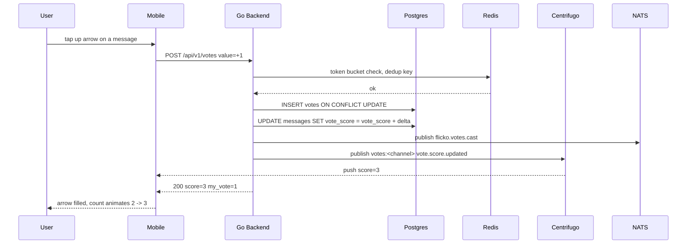

# Post Upvote/Downvote Global — App Flow

## 1. End-to-End Journey



## 2. State Machine

Per target, per user:

```
[none] -- up   --> [up]
[none] -- down --> [down]
[up]   -- up   --> [none]
[up]   -- down --> [down]
[down] -- down --> [none]
[down] -- up   --> [up]
```

Channel state:

```
[disabled] -- owner toggle --> [enabled]
[enabled]  -- owner toggle --> [disabled]   (existing votes preserved, hidden)
```

## 3. User Journeys

### J1 — Happy path

1. Member taps up arrow on a help post
2. Optimistic UI fills the arrow and bumps count by +1
3. API responds 200 with authoritative score
4. WS push lands at all viewers within ~150ms

### J2 — Switch from up to down

1. User had upvoted, taps down
2. Client computes delta = -2
3. Server records change atomically via single UPSERT
4. Score goes from 3 to 1 in one frame

### J3 — Rate limited

1. Bot-like behavior: 60+ votes in a minute
2. API returns 429 with retry-after
3. UI shows snackbar "Slow down for a sec"
4. Local UI rolls back optimistic state

### J4 — Channel disabled

1. Owner flips `votes_enabled=false` for #venting
2. Existing arrows fade out within 1s via WS push
3. Stored votes remain in DB for audit, just hidden

### J5 — Brigade detected

1. 14 new accounts downvote a post within 4 minutes
2. Guard flags suspicious cluster, votes still cast but marked `suspect=true`
3. Post score in UI ignores suspect votes until mod review
4. Mod audit panel highlights the cluster

## 4. Edge Cases

- Offline: queue vote in Hive box `votes_outbox`, replay on reconnect with idempotency key
- Permission denied: arrows hidden if not member, disabled if account too young
- Stale score: WS push wins over local optimistic
- Concurrent same-user double-tap: dedup at Redis layer with 1s SETNX
- Account age <24h: arrows visible, tap shows tooltip "Available after 24h on Flicko"
- Self-vote on own message: blocked at API, arrow disabled with tooltip
- Deleted target: vote retracts automatically on cascade

## 5. Background / Async

- Triggered by:
  - `flicko.votes.cast` -> denormalized count rebuilder for messages and forum posts
  - Hourly brigade guard re-run on last 24h of votes
- Schedule: rebuild counts every 5 minutes, cron `*/5 * * * *`
- Idempotency key: `vote:<user_id>:<target_kind>:<target_id>:<value>`
- Failure policy: retry 3x, then DLQ `flicko.votes.dlq`

## 6. Notifications

- Trigger: post crosses score thresholds 10, 50, 100
- Channel: in-app only, toast on author's home tab
- Copy: "Your post hit {N} upvotes in {channel}"
- Deep link: `flicko://server/<id>/channels/<cid>/messages/<mid>`
- Batching rule: max 1 per author per hour
