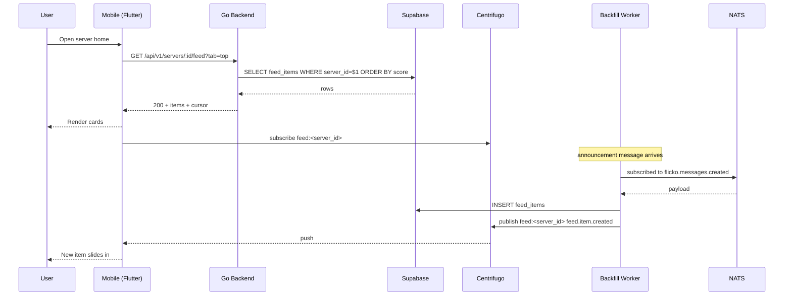

# Server Feed Timeline — App Flow

## 1. End-to-End Journey



## 2. State Machine

```
[idle] -- open --> [loading]
[loading] -- 200 --> [content]
[loading] -- network err --> [error]
[error] -- retry --> [loading]
[content] -- ws push --> [content+pending]
[content+pending] -- tap banner --> [content]
[content] -- pull refresh --> [refreshing]
[refreshing] -- 200 --> [content]
[content] -- offline --> [content_stale]
[content_stale] -- reconnect --> [refreshing]
```

## 3. User Journeys

### J1 — Happy path, returning member

1. User opens the Aurora Devs server
2. Feed screen lands with cached top 20 items in <120ms
3. Catch-up banner shows "14 new since Tuesday"
4. User taps banner, scrolls to last-visit marker
5. Skims cards, taps "v2 launch" announcement, deep link routes to `#announcements`
6. Returns to feed. App writes `mark-read up_to=now()`

### J2 — Error path

1. Connection drops mid-scroll
2. Pagination request fails after 8s
3. Inline banner appears at bottom: "Cannot load more, retry"
4. User taps retry, succeeds, items append
5. If retry fails twice, switch to offline cached page from Hive

### J3 — First-time empty state

1. New server, owner opens feed for first time
2. Empty illustration + copy "Pin a post to start your feed"
3. CTA opens channel picker; user pins a welcome message
4. Feed re-renders with 1 pinned card

### J4 — Pin a post

1. Owner long-presses a forum-post card
2. Context menu: Pin, Hide, Report, Copy link
3. Owner picks Pin -> POST `/feed/:item_id/pin`
4. Optimistic UI: badge appears immediately
5. On failure, revert with toast

### J5 — Hide an item (member)

1. Member long-presses, picks "Not interested"
2. Local hide stored; server records hide reason for ranker
3. Card slides out with undo snackbar (5s)

## 4. Edge Cases

- Offline: queue mark-read calls, sync on reconnect; reads from Hive cache
- Permission denied: pin/hide options absent from menu (not just disabled)
- Stale data: last-write-wins; server timestamps authoritative
- Concurrent pin actions: server enforces unique active-pin order; later wins, others bumped
- Rate limit hit: backoff + UI hint "Slow down for a sec"
- Network slow: optimistic UI for pin/hide; rollback on failure
- Empty server (no source content): show ASCII illustration, no CTA flicker
- Hidden source channel: feed item still shows summary but tap shows "You don't have access"
- Source deleted: card auto-removes within 60s via NATS

## 5. Background / Async

- Triggered by:
  - `flicko.messages.created` for messages in announcements channels
  - `flicko.forum.post.created`
  - `flicko.events.scheduled`
  - `flicko.votes.threshold` when a message crosses 5 net votes
- Schedule: ranker re-scores every 5 minutes, cron `*/5 * * * *`
- Idempotency key: `feed:<source_kind>:<source_id>`
- Failure policy: retry 3x with exponential backoff, then DLQ subject `flicko.feed.dlq`
- Daily retention sweep at 03:00 UTC archives items older than 60 days

## 6. Notifications

- Trigger event: owner pins a post; notify members who opted into "important pins"
- Channel: push (default), in-app, email digest weekly
- Copy: "{owner} pinned in {server}: {title}"
- Deep link: `flicko://server/<id>/feed/<item_id>`
- Batching rule: max 1 per server per 30 minutes
- Preferences: mirror Discord notification levels (All, Mentions, None)
