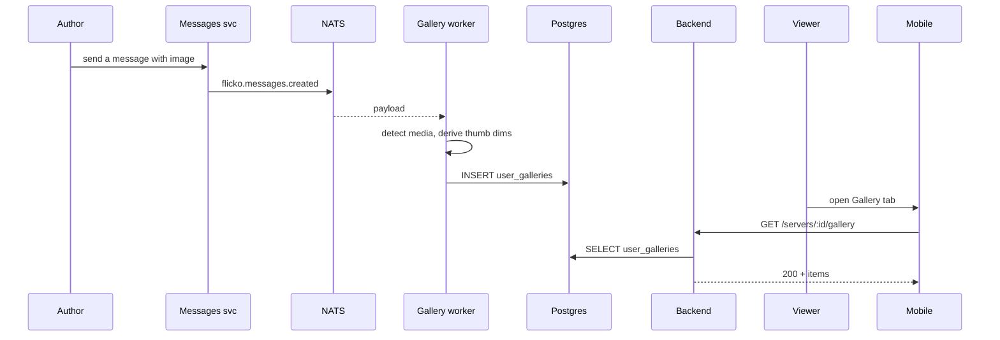

# Server Gallery — App Flow

## 1. End-to-End Journey



## 2. State Machine

```
[unindexed] -- worker ingest --> [visible]
[visible]   -- author hide   --> [hidden]
[visible]   -- mod remove    --> [removed]
[visible]   -- feature       --> [visible+featured]
[any]       -- source deleted --> [removed]
```

## 3. User Journeys

### J1 — Browse

1. Member opens Gallery tab
2. Mosaic grid loads with newest 60 items
3. Tap image -> lightbox
4. Swipe to navigate; bottom toolbar shows "Open message" to jump to source

### J2 — Filter

1. Member taps Filters
2. Picks #art channel and Author @riku
3. Apply -> grid refreshes
4. Filter pills shown above grid; tap pill to remove

### J3 — Owner features an item

1. Owner long-presses tile -> Feature
2. Tile gains border tint
3. Featured tab now lists it; appears in About tab carousel (when public-profiles ships)

### J4 — Mod removes inappropriate

1. Mod long-presses tile -> Remove
2. Confirmation; reason optional
3. Tile fades out within 500ms; audit logged

### J5 — Author hides own

1. Author opens Gallery, finds own image
2. Long-press -> Hide mine
3. Item hidden from gallery only; chat message remains

## 4. Edge Cases

- Source message deleted: tile auto-removes within 60s
- NSFW unmarked content: report -> mod reviews
- Very large videos: skip if size > server-configured cap
- Thumb generation failure: fallback to playable inline
- Permission revoked: items in private channels disappear from gallery for that user
- Channel excluded after fact: existing tiles remain; new ones not ingested

## 5. Background / Async

- Worker subscribes `flicko.messages.created`, `flicko.messages.deleted`
- Backfill job scans last 90 days on first enable
- Cron daily prunes hidden >90d
- Idempotency key: `(server_id, message_id, media_url)`

## 6. Notifications

- Trigger: featured by owner
- Channel: in-app only
- Copy: "{owner} featured your post in the gallery"
- Deep link: `flicko://server/<id>/gallery/<item_id>`
- Batching: 1 per author per day
