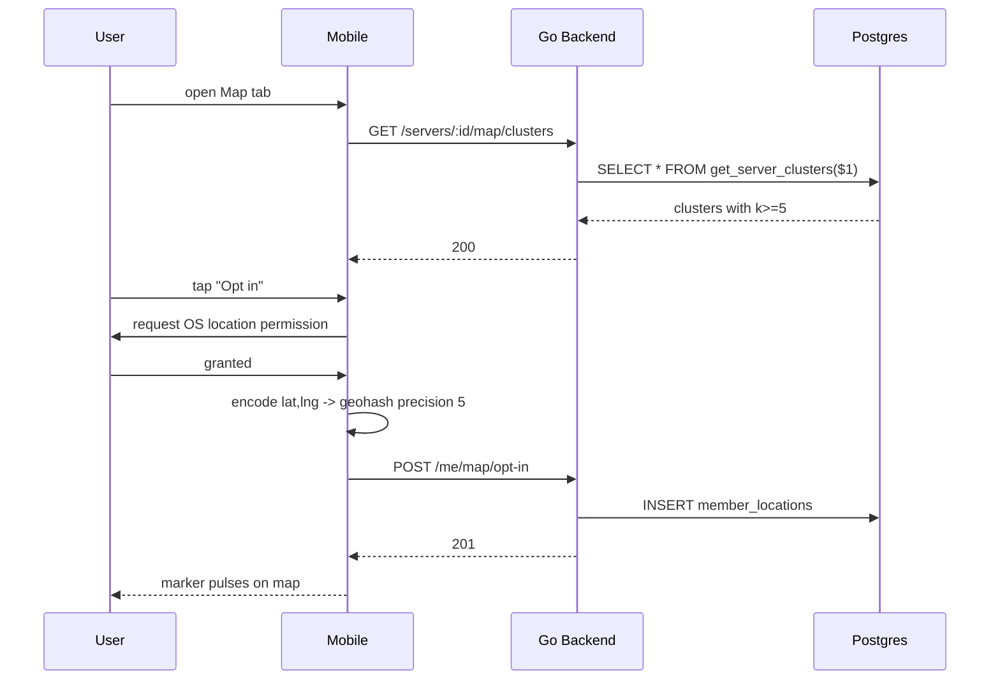

# Server Map — App Flow

## 1. End-to-End Journey



## 2. State Machine

```
[not_opted] -- consent --> [opting]
[opting]   -- granted   --> [active]
[opting]   -- denied    --> [not_opted]
[active]   -- precision change --> [active]
[active]   -- revoke    --> [not_opted]
[active]   -- minor age detected --> [active@precision=2]
[active]   -- 180d expiry --> [expiring]
[expiring] -- refresh   --> [active]
[expiring] -- ignore    --> [not_opted]
```

## 3. User Journeys

### J1 — Opt in (happy)

1. User opens Map tab, sees "Show me on the map" banner
2. Reads consent, picks Region precision
3. OS prompts location permission, user grants
4. Client computes geohash precision-4 from device location
5. POST opt-in succeeds; user appears in cluster

### J2 — Decline

1. User dismisses banner
2. Map shows clusters of others; user's own marker absent
3. Banner reappears once after 7d, then suppressed for 90d

### J3 — Coarsen due to k-anon floor

1. User in remote area opts in at City precision
2. Server checks geohash bucket count
3. Bucket has <5 members; server stores at precision 4 instead
4. UI shows "Bucketed at region for privacy"

### J4 — Revoke

1. User taps "Stop sharing"
2. Confirmation dialog
3. DELETE call succeeds; row removed within seconds
4. Worker sweep ensures full purge in 24h

### J5 — Minor account

1. User under 18 attempts City precision
2. Server forces precision=2 (country only)
3. Banner: "Country-level only for under-18 accounts"

## 4. Edge Cases

- Offline: opt-in form queues; submit on reconnect; explicit user feedback
- Permission denied at OS: graceful "Could not get location, try later"
- Bad geohash sent by malicious client: server validates length and charset
- VPN-derived location: accepted; we do not attempt to verify
- Minor user toggles age in profile: location coarsens immediately
- Server toggles map off: existing rows kept but hidden; can re-enable

## 5. Background / Async

- Cron daily 03:00 UTC: expire rows older than 180d
- Cron every 30 min: rebuild `member_location_clusters`
- Cron daily: enforce minor coarsening on accounts that age into >=18 or back

## 6. Notifications

- Trigger: 30 days before expiry
- Channel: in-app banner
- Copy: "Your map sharing for {server} expires in 30 days. Tap to refresh."
- Deep link: `flicko://server/<id>/map`
- Batching: 1 per server per expiry window
