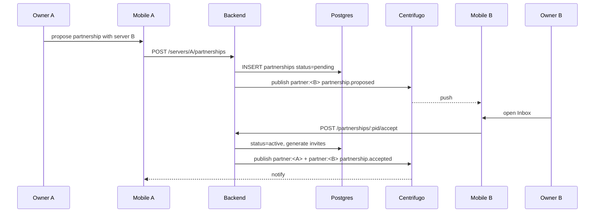

# Server Partnerships — App Flow

## 1. End-to-End Journey



## 2. State Machine

```
[none] -- propose --> [pending]
[pending] -- accept --> [active]
[pending] -- decline --> [declined]
[pending] -- timeout 14d --> [declined]
[active] -- terminate --> [cooldown]
[cooldown] -- 14d elapsed --> [none]
```

## 3. User Journeys

### J1 — Propose

1. Owner A goes to Server settings -> Partnerships -> Propose
2. Searches for server B by name or invite link
3. Adds optional message
4. Submits proposal
5. UI: "Awaiting acceptance"

### J2 — Accept

1. Owner B receives push + inbox card
2. Reviews server A profile, optional message
3. Taps Accept
4. System generates two invite codes (one each direction), invite slots populate

### J3 — Decline / timeout

1. Owner B taps Decline (or waits 14d)
2. Status -> declined
3. Owner A notified

### J4 — Browse partners (member)

1. Member opens server About tab
2. Scrolls to Partners
3. Sees up to 25 partner cards with logos and short descriptions
4. Taps a card -> partner server discovery preview

### J5 — Terminate

1. Owner A taps Terminate
2. Confirms with reason (optional)
3. Status -> cooldown for 14d
4. Re-pairing locked during cooldown

## 4. Edge Cases

- Owner change: partnership remains; banner prompts new owner to re-confirm in 30d
- Server deletion: cascade -> partnership terminated
- Invite revoked manually: regenerate via worker; if not regen-able, status auto-paused
- Spam proposals: rate-limit 5 outbound/day per server; abuse reports flagged
- Both sides propose simultaneously: dedup at insert via unique pair index; auto-accept

## 5. Background / Async

- Cron daily 03:00 UTC: expire pending >14d
- Cron hourly: rebuild `partnership_metrics`
- Listener for invite-revocation events to regenerate slots
- Idempotency key: `partnership:<a>:<b>:<verb>`

## 6. Notifications

- Trigger: proposed, accepted, declined, terminated
- Channel: in-app + email to managers
- Copy: "{server} proposed a partnership"
- Deep link: `flicko://server/<id>/settings/partnerships/inbox`
- Batching: 1 per server per 30 min
