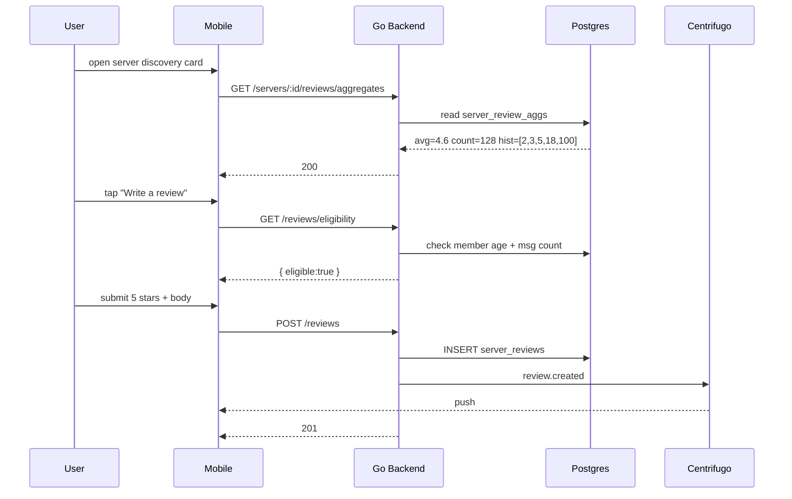

# Server Reviews — App Flow

## 1. End-to-End Journey



## 2. State Machine

```
[ineligible] -- meets criteria --> [eligible]
[eligible]   -- compose start    --> [drafting]
[drafting]   -- submit           --> [submitting]
[submitting] -- 201              --> [posted]
[submitting] -- err              --> [drafting+error]
[posted]     -- edit window      --> [editable]
[editable]   -- 30d expires      --> [locked]
[posted]     -- delete           --> [deleted]
```

## 3. User Journeys

### J1 — First review (happy)

1. User taps "Write a review" on discovery page
2. Eligibility passes (member 22d, 47 messages)
3. Composer appears: 5 star tap + 180-char body
4. Submit -> success toast
5. Review card appears at top of list with "Just now"

### J2 — Eligibility blocked

1. User is 6 days into a server, taps "Write a review"
2. Modal appears: "Members can review after 14 days and 20 messages. You have 6 days and 13 messages."
3. CTA: "Got it"

### J3 — Owner reply

1. Owner sees a 3-star review with constructive feedback
2. Taps "Reply"
3. Writes a thank-you note
4. Reply renders nested under the review

### J4 — Report a hostile review

1. User taps "..." menu on a review, picks Report
2. Selects reason: "Hateful or harmful"
3. Mod queue receives ticket; review remains visible until action

### J5 — Edit existing review

1. User opens own review within 30 days
2. Tap edit, changes 4 stars to 5
3. Submit -> "Edited 1m ago" timestamp shows

## 4. Edge Cases

- Offline: composer saved as draft locally; submit retries on reconnect
- Permission denied: "Compose" hidden, not just disabled
- Stale aggregates: client refetches on focus
- Concurrent edit by same user across devices: last-write-wins
- Rate limit: 5 review actions per minute per user
- Server became private mid-review: review hidden from non-members but kept
- Owner left server: replies remain attributed to former-owner with role badge "Former Owner"

## 5. Background / Async

- Triggered by:
  - `flicko.reviews.created` -> recalc aggregates for server
  - `flicko.reviews.helpful` -> nudge brigade guard
- Schedule: aggregate sweep every 10 minutes, full nightly rebuild at 03:00 UTC
- Idempotency key: `review:<user_id>:<server_id>`
- Failure policy: retry 3x, DLQ subject `flicko.reviews.dlq`

## 6. Notifications

- Trigger: someone replies to your review (owner reply)
- Channel: in-app + push if author opted in
- Copy: "{owner} replied to your review of {server}"
- Deep link: `flicko://discovery/server/<id>/reviews/<rid>`
- Batching: max 1 per server per 24h
