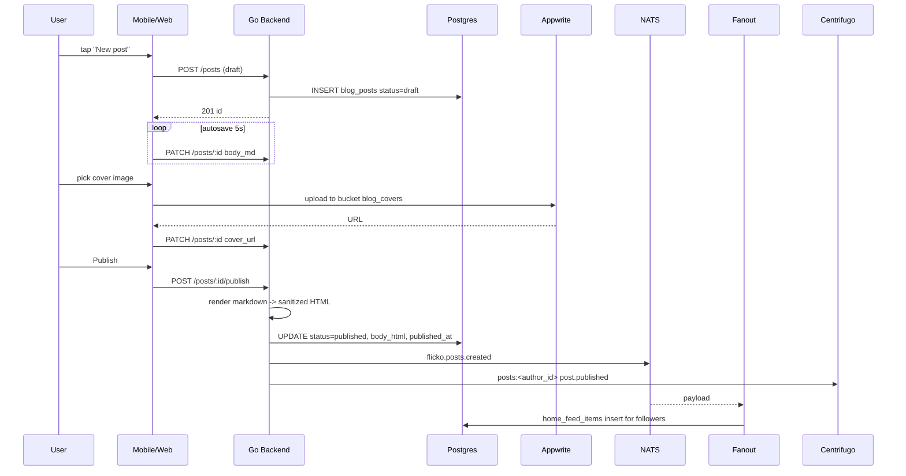

# User Blog Posts — App Flow

## 1. End-to-End Journey



## 2. State Machine

```
[idle] -- new --> [draft]
[draft] -- save --> [draft]
[draft] -- publish --> [published]
[published] -- edit --> [editing]
[editing] -- save --> [published]
[published] -- unpublish --> [unlisted]
[any] -- delete --> [removed]
[any] -- mod takedown --> [removed]
```

## 3. User Journeys

### J1 — Write and publish

1. User taps "New post" from profile or home
2. Editor opens with title and markdown body
3. Autosave to draft every 5s
4. User adds cover image and tags
5. Tap Publish
6. Toast: "Published. Sharing with your followers."
7. Post appears on profile, home feed for followers

### J2 — Edit a published post

1. User opens own post, taps Edit
2. Edits body, saves
3. UI shows "edited 1m ago"
4. Followers do not get re-notified; only the original publish triggered fanout

### J3 — Comment thread

1. Reader scrolls to comments
2. Types a 200-char reply, hits Post
3. Comment appears under the post
4. Author optionally pins the comment

### J4 — Like

1. Reader taps heart
2. Like count animates +1
3. Post owner gets aggregated daily push: "32 new likes today"

### J5 — Mod takedown

1. Mod identifies hateful comment, taps Remove
2. Comment becomes status=removed; UI shows "Removed by moderator"

## 4. Edge Cases

- Offline: drafts saved locally + queued PATCH; resolved on reconnect with last-write-wins
- Permission denied: published-only when status=draft; 404 to non-author
- Stale: editor uses `if-match` etag; conflict opens merge dialog
- Concurrent edits across devices: last save wins; previous version retained for 30d
- Rate limit: 3 publishes/day; 30 comments/min/user
- Network slow: optimistic UI on like; rollback on failure
- XSS: server sanitizes via Bluemonday; attempted scripts stripped

## 5. Background / Async

- Triggered by:
  - `flicko.posts.created` -> fanout to followers (uses user-following service)
  - `flicko.posts.created` -> indexer pushes to Meilisearch
- Schedule: nightly `posts_archive_old_drafts` worker
- Idempotency: post id
- Failure: retry 3x, DLQ subject `flicko.posts.dlq`

## 6. Notifications

- Trigger: someone likes/comments your post; aggregated daily
- Channel: in-app + push
- Copy: "{name} commented on your post {title}"
- Deep link: `flicko://users/<id>/posts/<slug>`
- Batching: max 1 per post per hour
