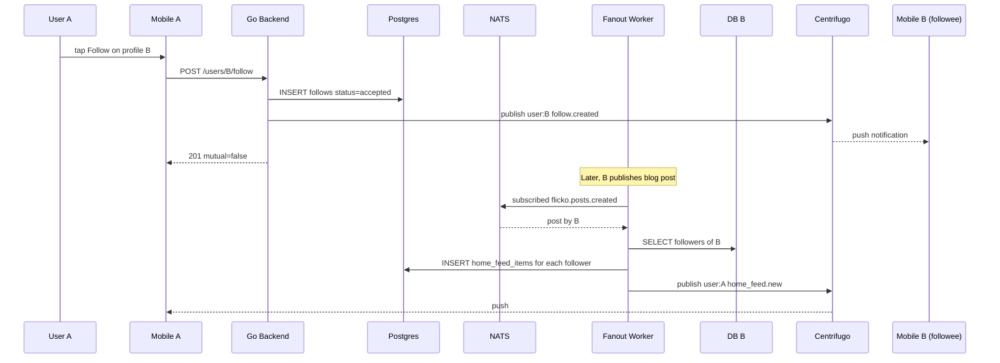

# User Following — App Flow

## 1. End-to-End Journey



## 2. State Machine

```
[not_following] -- follow --> [following]
[not_following] -- follow (private) --> [pending]
[pending] -- accept --> [following]
[pending] -- decline --> [not_following]
[following] -- unfollow --> [not_following]
[following] -- target blocks --> [not_following]
[any] -- target deactivates --> [not_following]
```

## 3. User Journeys

### J1 — Follow (public)

1. A taps Follow on B's profile
2. Optimistic UI: button changes to "Following"
3. POST returns 201
4. B's follower count animates +1

### J2 — Follow with approval

1. A taps Follow, B is `require_approval=true`
2. Status pending; UI: "Requested"
3. B sees request in inbox, taps Accept
4. A receives push: "B accepted your follow request"

### J3 — Mutual badge

1. A follows B; later B follows A back
2. Both UIs render a small two-arrow icon next to handle
3. DM panel surfaces "Mutual" label

### J4 — Home feed read

1. A opens Home tab
2. Loads `home_feed_items` page 1
3. Cards from followed users with kind labels
4. Tapping opens source

### J5 — Block prevents follow

1. B previously blocked A
2. A taps Follow -> 403 with friendly message "B is not accepting follows from you"
3. UI shows neutral state, no specific reason

## 4. Edge Cases

- Offline: queue follow toggle, replay on reconnect; idempotent by (follower, followee)
- Permission: hidden if user has `followable=false`
- Stale: WS push reconciles follower count
- Concurrent toggles: last-write-wins; version column not required
- Rate limit: 30 follow actions per minute per user
- Account deactivation: cascade-remove follows
- Block while pending request: request auto-declined, removed
- Server private posts excluded from home feed via RLS at fanout time

## 5. Background / Async

- Fanout worker subscribes to `flicko.posts.created`
- For followee with <=5000 followers, push to `home_feed_items`
- Above 5000, mark "pull on read" and serve via runtime join
- Cron daily at 02:00 UTC prunes home_feed_items >30d
- Idempotency key: `home_feed:<follower>:<item_kind>:<item_id>`
- Retry 3x, DLQ `flicko.home_feed.dlq`

## 6. Notifications

- Trigger: someone follows you, or accepts your request, or you have a follow request
- Channel: push + in-app + email digest weekly
- Copy:
  - "{name} followed you"
  - "{name} accepted your request"
  - "{name} wants to follow you"
- Deep link: `flicko://users/<id>` or `flicko://me/follow-requests`
- Batching: 1 per follower per 7 days
