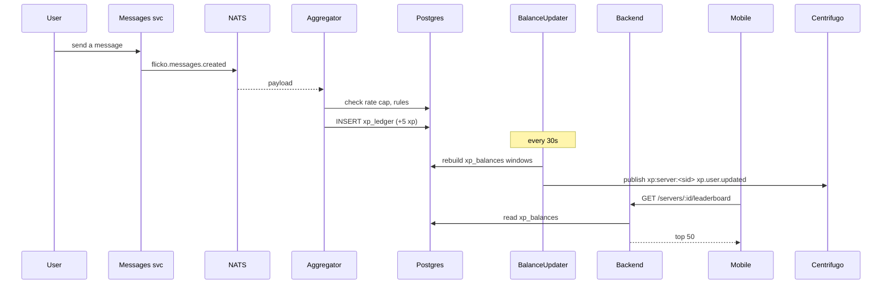

# User Leaderboards Native — App Flow

## 1. End-to-End Journey



## 2. State Machine

User XP per server:

```
[fresh] -- earn --> [accumulating]
[accumulating] -- threshold --> [level_up]
[level_up] -- continue --> [accumulating]
[accumulating] -- season reset --> [seasonal_zero+all-time_kept]
```

## 3. User Journeys

### J1 — First level up

1. User sends 50 messages, hits level 5
2. Push: "You leveled up in Aurora Devs"
3. Badge added; tile glows in their rank card
4. Optional in-channel toast (config)

### J2 — Owner tweaks rules

1. Owner opens Server Settings -> XP
2. Changes message weight from 5 to 3
3. Save -> applies forward
4. Banner: "Rules updated. Existing XP preserved."

### J3 — Member checks own rank

1. Member opens Members -> Leaderboard
2. Sees Top 50 with self-card pinned at top
3. Tap own card -> breakdown screen with sources

### J4 — Detect grinding

1. User triggers per-minute cap
2. UI shows "Cooling down to keep things fair, more XP in 30s"

### J5 — Season reset

1. Owner taps Reset Season with explicit confirm
2. Seasonal balances zeroed; all-time preserved
3. Push: "{server} started a new season"

## 4. Edge Cases

- Bot accounts: excluded by `excluded_role_bots` flag default true
- Excluded channels: events from those channels skipped at aggregator
- Voice afk: aggregator only counts minutes when audio frames recently received
- Backfill on enable: events from prior 30d optionally counted via worker
- Server soft-deleted: pause events; preserve data
- User leaves server: balances preserved for 90d in case they rejoin

## 5. Background / Async

- Aggregator subscribes to multiple NATS subjects; runs continuously
- Balance updater every 30s; full rebuild nightly
- Decay job daily at 04:00 UTC if `decay_per_day > 0`
- Idempotency key: `xp:<source>:<source_id>:<user>:<server>`

## 6. Notifications

- Trigger: level up, season reset
- Channel: in-app + push if opted
- Copy: "You leveled up in {server}: Level {N}"
- Deep link: `flicko://server/<id>/leaderboard`
- Batching: 1 per server per hour
