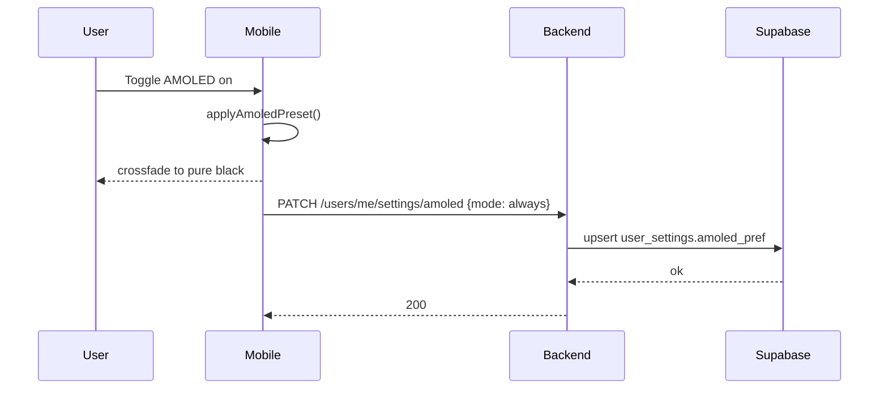

# AMOLED Dark Mode — App Flow

## 1. End-to-End Journey



## 2. State Machine

```
[off] -- toggleOn(always) --> [on:always]
[off] -- toggleOn(systemDark) --> [on:systemDark]
[off] -- toggleOn(sunset) --> [permissionPending]
[permissionPending] -- granted --> [on:sunset]
[permissionPending] -- denied --> [on:systemDark+toast]
[on:systemDark] -- systemEntersDark --> [active]
[on:systemDark] -- systemEntersLight --> [inactive(amoled invisible)]
[on:sunset] -- sunsetReached --> [active]
[on:sunset] -- sunriseReached --> [inactive]
[on:*] -- toggleOff --> [off]
```

## 3. User Journeys

### J1 — Manual toggle from Appearance
1. User opens Settings → Appearance.
2. Sees AMOLED section with preview tile.
3. Taps toggle → "Always" preselected.
4. Surfaces crossfade to black across the app.
5. Preference persists; next launch already AMOLED.

### J2 — Battery saver auto-suggest
1. User puts phone on battery saver during a chat session.
2. App listens to platform battery saver event.
3. Snackbar appears: "Battery saver is on. Switch to AMOLED?"
4. User taps Switch on → mode = always, snackbar dismisses, surfaces transition.
5. Cooldown 30 days before suggesting again on this device.

### J3 — Sunset mode
1. User picks "After sunset" → app requests `location.coarse`.
2. On grant, app computes sunset for today using `solar` Dart package (offline).
3. AMOLED activates at sunset, deactivates at sunrise.
4. Recompute daily at midnight.

### J4 — User without OLED
1. Lint not enforced; user enables anyway.
2. Settings hint subtitle: "Best on OLED screens; on LCDs blacks may look crushed."
3. They proceed; preference is honored.

## 4. Edge Cases

- **Mode = sunset, location permission revoked at OS level:** fallback to `systemDark` with toast.
- **User on tablet without battery saver concept:** snackbar never fires.
- **System dark off but mode = always:** AMOLED still applies (override).
- **Multiple devices:** preference syncs server-side; conflicts last-write-wins.
- **Theme has explicit dark variant + AMOLED on:** AMOLED wins for surfaces, theme wins for accents (see UIUX §11).

## 5. Background / Async

- **Sunset recompute:** WorkManager/iOS BGAppRefresh task daily at midnight local.
- **Battery saver listener:** OS-driven; no polling.
- **Idempotency key:** `amoled:pref:<user_id>:<minute_bucket>`.

## 6. Notifications

- No push notifications. AMOLED is a silent preference.
- In-app: one snackbar on first battery saver event per 30d.
- Deep link: `flicko://settings/appearance/amoled` from snackbar tail "Settings".
