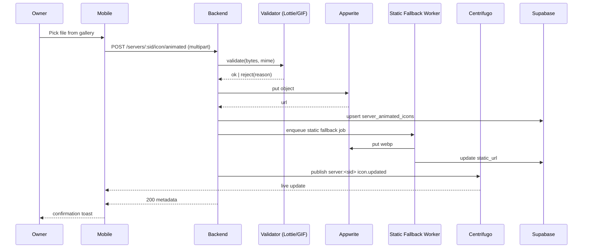

# Animated Server Icons — App Flow

## 1. End-to-End Journey



## 2. State Machine

```
[noIcon] -- upload --> [validating]
[validating] -- ok --> [storingAnimated]
[validating] -- reject --> [noIcon+toast]
[storingAnimated] -- ok --> [pendingFallback]
[pendingFallback] -- ready --> [active]
[active] -- disable --> [noIcon]
[active] -- replace --> [validating]
[active] -- reportThreshold --> [hiddenForReview]
```

## 3. User Journeys

### J1 — Owner uploads animated icon
1. Owner opens Server Settings → Appearance.
2. Taps the round icon → bottom sheet "Replace icon" → "Choose animated".
3. Picks `logo.json` (Lottie).
4. Validator passes; preview tile loops on screen.
5. Sidebar entry for the server now animates after Centrifugo push.

### J2 — Photosensitive content rejected
1. Owner uploads a fast-strobe GIF.
2. Validator computes flash rate; flags `photosensitive_warning=true`.
3. UI shows: "This icon may trigger photosensitive seizures. Are you sure?" with "Submit for review" or "Choose different".
4. If submitted, status `pending_admin`; sidebar continues showing prior icon until approved.

### J3 — Member reports an icon
1. Member long-presses sidebar icon → "Report icon".
2. Picks reason; row inserted in `server_icon_reports`.
3. Admin reviews; can disable.
4. Affected server falls back to static initial icon.

### J4 — Reduced motion
1. Member has OS reduced-motion enabled.
2. Mobile detects via `MediaQuery.disableAnimations`.
3. Sidebar renders `static_url` instead of animation, no extra fetch.

### J5 — First-time empty state
1. New server has no icon at all.
2. Sidebar uses initials avatar; settings show "Add icon" CTA.

## 4. Edge Cases

- **Offline upload:** queue in Hive, retry on reconnect; toast "Will upload when online".
- **Replace mid-render:** widget switches via crossfade 120ms.
- **Battery saver:** widget pauses Lottie/GIF animation; static fallback shown.
- **Off-screen:** `VisibilityDetector` pauses animation when sidebar hidden.
- **Lottie expressions detected:** reject with reason "scripts not allowed".
- **Static fallback not ready yet:** show first frame derived client-side.
- **Bandwidth saver:** never load animated, always static.

## 5. Background / Async

- **Static fallback worker:** consumes NATS subject `flicko.icons.fallback`, idempotency key `icon:fallback:<server_id>:<upload_id>`.
- **Photosensitive re-eval:** re-runs heuristics weekly on flagged icons.
- **Failure policy:** retry 3× exp backoff, then DLQ.

## 6. Notifications

- Owner: in-app toast on success.
- Owner: push when icon is removed by admin moderation.
- Members: silent — no notification on icon change.
- Deep link: `flicko://servers/<sid>/settings/appearance`.
