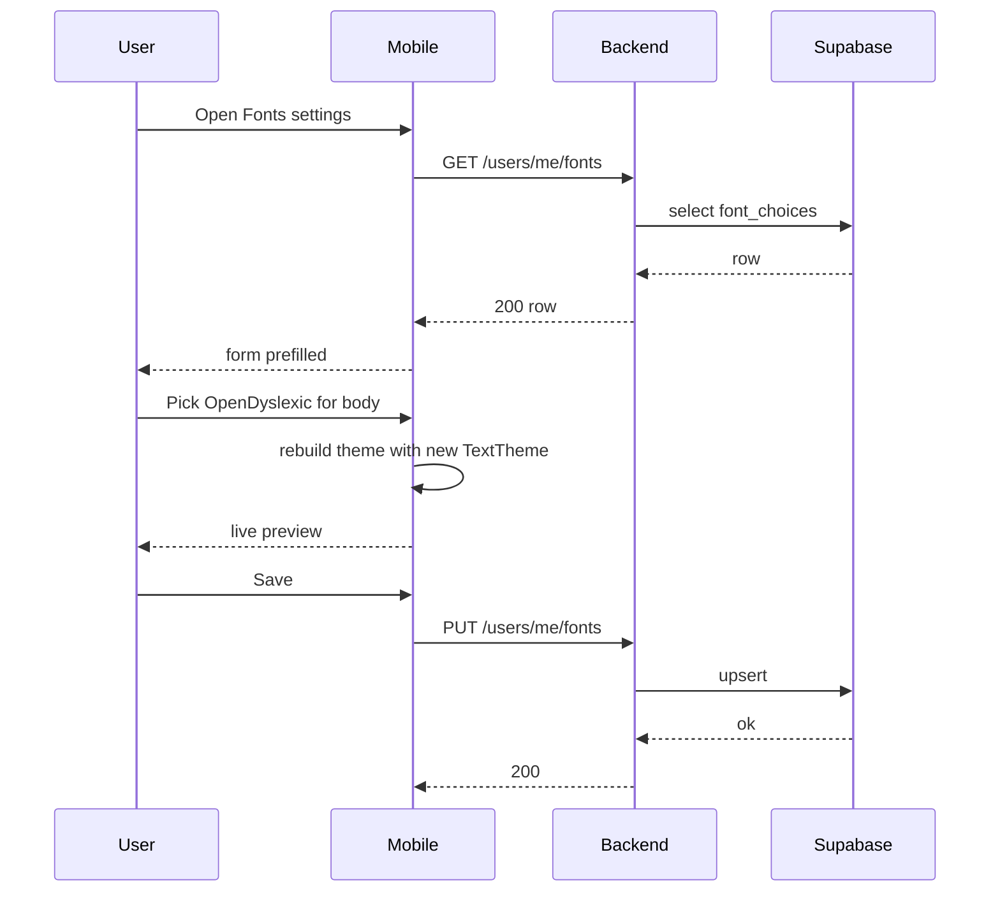

# Custom Fonts — App Flow

## 1. End-to-End Journey



## 2. State Machine

```
[default] -- pick --> [previewing]
[previewing] -- save --> [persisting]
[persisting] -- ok --> [active]
[persisting] -- err --> [previewing+toast]
[active] -- reset --> [default]
```

## 3. User Journeys

### J1 — Dyslexia user enables OpenDyslexic
1. Dani opens Settings → Accessibility → spots "Use OpenDyslexic" shortcut.
2. Taps once — body, headers, and mono all switch.
3. Live preview confirms; toast "OpenDyslexic on across the app".

### J2 — Aesthetic user mixes fonts
1. User opens Fonts settings.
2. Sets body Noto Serif, headers JetBrains Mono, monospace JetBrains Mono.
3. Saves; chat re-renders.

### J3 — System font (Android)
1. User on OnePlus with custom system font enables "Use system font".
2. Platform channel returns the system font family name.
3. App resolves to that family if available, otherwise falls back to Inter with toast.

### J4 — User upload (v2)
1. User taps Upload → picks `.ttf`.
2. Sandboxed parser validates; rejects if malformed or contains expressions.
3. On success, uploaded font becomes a new option in pickers.

### J5 — Empty state
1. New user has no row in `font_choices` — defaults applied.
2. No empty UI; settings populated with defaults.

## 4. Edge Cases

- **Offline save:** queue + retry; UI shows "Saved locally, will sync".
- **Whitelisted font no longer shipped:** server returns 200 but client maps to closest; row left as-is for forward compat.
- **System font name unknown to Flutter:** fallback to Inter with toast.
- **Font file fails to load at runtime:** Sentry breadcrumb + revert to default.
- **Multi-device:** server is source of truth on cold start; local override on session.

## 5. Background / Async

- No async workers in v1.
- v2: font upload triggers parse job; idempotency key `font:upload:<user_id>:<sha>`.

## 6. Notifications

- None. Silent preference.
