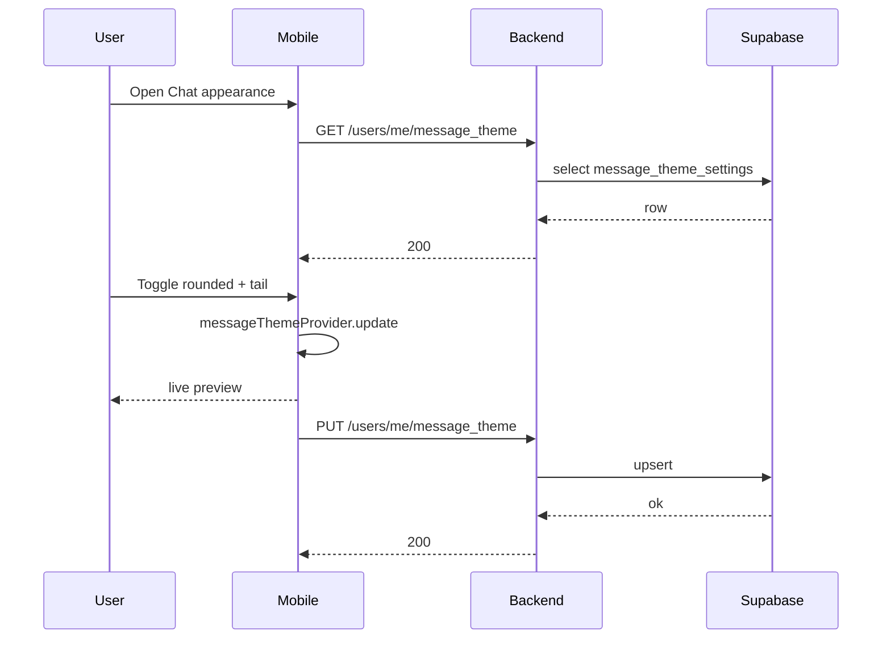

# Message Themes — App Flow

## 1. End-to-End Journey



## 2. State Machine

```
[default] -- changeShape --> [editing]
[editing] -- changeTail --> [editing]
[editing] -- changeDensity --> [editing]
[editing] -- save (debounce 600ms) --> [persisting]
[persisting] -- ok --> [active]
[persisting] -- err --> [editing+toast]
[active] -- reset --> [default]
```

## 3. User Journeys

### J1 — Switch to bubbly chat
1. User opens Chat appearance.
2. Picks Rounded → tail auto-on.
3. Density Cozy.
4. Preview pane shows immediate effect.
5. Backend persists; chat thread reflects new style on return.

### J2 — Productivity user goes compact
1. User picks Square + Compact.
2. Density tightens; more messages on screen.
3. Reactions + replies still visible (golden-tested).

### J3 — User reverts to default
1. Hits Reset.
2. Square, no tail, Cozy applied.
3. Toast "Reset done".

### J4 — Reduced motion user
1. Density change applies instantly.
2. Shape change applies instantly (no morph).

### J5 — First-time empty state
1. New user has no row — defaults apply.
2. Settings already populated.

## 4. Edge Cases

- **Offline save:** queue + retry.
- **Multi-device:** server is source of truth on cold start; in-session optimistic.
- **Classic shape + tail toggle:** server enforces tail=false; client UI disables toggle.
- **Long messages with compact density:** wrap normally; line-height kept ≥1.3.
- **Reactions overflow under compact:** chip count compresses; no truncation.

## 5. Background / Async

- No async workers.
- Idempotency key: `msg_theme:set:<user_id>:<minute_bucket>`.

## 6. Notifications

- None. Silent preference.
