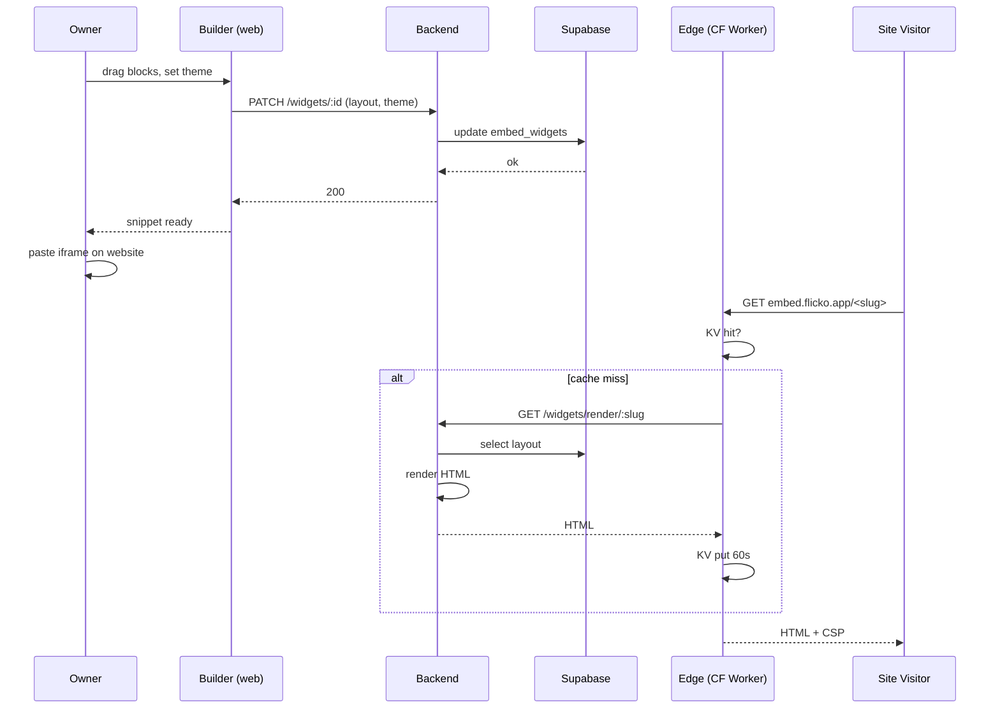

# Widget Builder — App Flow

## 1. End-to-End Journey



## 2. State Machine

```
[empty] -- dropFirstBlock --> [editing]
[editing] -- save --> [saved]
[editing] -- err --> [editing+toast]
[saved] -- edit --> [editing]
[saved] -- copySnippet --> [snippetCopied]
[saved] -- delete --> [empty]
```

## 3. User Journeys

### J1 — Owner builds and embeds
1. Owner opens server settings → Embed widgets → opens browser at builder URL with auth handoff.
2. Drags `member_count` and `recent_posts` onto canvas.
3. Sets theme primary `#7AA2F7`, mode auto.
4. Adds frame ancestor `mygame.com`.
5. Hits Save; chip "Saving..." → "Saved".
6. Hits Snippet → copies iframe snippet.
7. Pastes on `mygame.com/community`; widget renders within 300ms on first visit.

### J2 — Visitor views the embed
1. Visitor loads owner's website.
2. Browser requests `embed.flicko.app/<slug>` inside iframe.
3. Edge worker serves cached HTML (60s TTL).
4. CSP rejects any other ancestor; `mygame.com` allowed.

### J3 — Owner changes layout
1. Owner reorders blocks; auto-save triggers.
2. Edge cache invalidates via `purge` API call (best-effort) and TTL expires within 60s.
3. Visitors see new layout within 60s.

### J4 — Empty state
1. Owner opens builder, canvas is empty.
2. Empty illustration + "Drag a block to start" + 3 starter templates.

### J5 — CSP violation reported
1. Visitor on a non-allowlisted site loads embed.
2. Edge returns 403 with HTML "Embed not authorized for this domain".
3. Sentry breadcrumb in owner dashboard: "blocked: example.com (5 in last hour)".
4. Owner can add to allowlist in builder.

## 4. Edge Cases

- **Server deleted:** widget marks `enabled=false`; edge serves "This server has closed" stub.
- **Owner removed widget:** 404 from edge.
- **Slug collision:** generation retries up to 5 times with random suffix.
- **Render timeout from origin:** edge serves stale-while-revalidate up to 24h.
- **Block of unsupported type:** edge ignores; no break.
- **Brand color too low contrast:** validator at save rejects with red ring on swatch.

## 5. Background / Async

- **View aggregator:** every minute, edge logs view counts to `embed_widget_views`.
- **Cache warmer:** when widget saved, `POST` to edge KV preload endpoint.
- **Idempotency key:** `widget:save:<id>:<minute_bucket>`.
- **Failure policy:** retry 3× exp backoff.

## 6. Notifications

- Owner: in-app push when CSP-violation count >50/h: "Your widget is being embedded on unauthorized domains."
- Deep link: builder URL.
