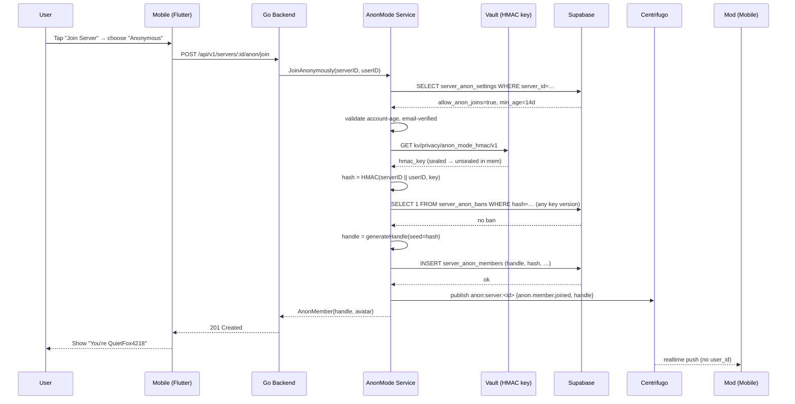

# Anonymous Mode — App Flow

## 1. End-to-End Journey



## 2. State Machine

```
[idle]
  -- tap Join → [picking_identity]
[picking_identity]
  -- choose anon → [generating_handle]
  -- choose real → [joining_real]   (out of scope here)
[generating_handle]
  -- success → [previewing_handle]
  -- error → [handle_error]
[previewing_handle]
  -- regenerate → [generating_handle]
  -- confirm → [joining_anon]
[joining_anon]
  -- success → [joined_anon]
  -- banned → [banned]
  -- forbidden → [anon_disallowed]
  -- error → [join_error]
[joined_anon]
  -- tap reveal → [confirming_reveal]
[confirming_reveal]
  -- confirm → [revealing]
  -- cancel → [joined_anon]
[revealing]
  -- success → [revealed]
  -- error → [reveal_error]
[banned]
  -- terminal (user shown ban reason)
[anon_disallowed]
  -- can choose real or back-out
```

## 3. User Journeys

### J1 — Happy path (join anonymously)
1. User receives invite link to "Survivor Support".
2. Taps it → join sheet opens; default option is "Anonymous (recommended)" because the server allows it.
3. Sees handle preview `QuietFox4218` with shuffle button.
4. Taps Join → 201 received, lands inside the server with the anon handle visible.
5. Posts a message; other members see `QuietFox4218`. Mods see the same handle plus an internal-hash badge they can ban.

### J2 — Re-join after ban (ban evasion attempt)
1. Mod banned `QuietFox4218`. The internal hash is now in `server_anon_bans`.
2. Same user tries to join again.
3. New handle would be different (`SilentOwl9930`), but the HMAC of `(server_id, user_id)` is identical.
4. Join service sees the ban → returns 403 with reason "You are banned from this server."
5. User cannot re-join even by deleting and re-creating Flicko account? Actually the HMAC would change because user_id changes. We document this caveat in the threat model — full sybil resistance is out of scope.

### J3 — Reveal identity later
1. User in `Survivor Support` decides to come out as themselves.
2. Opens server-side profile → "Reveal real identity."
3. Confirmation dialog with checkbox "I understand this cannot be undone."
4. Taps Reveal → API updates `is_revealed = true`, audit-log entry written.
5. From now on members and mods see `@taylor_2024`. Previous messages remain attributed to `QuietFox4218` historically; new messages show real handle.

### J4 — First-time empty state for mods
1. Server owner enables "Allow anonymous joins."
2. No anon members yet.
3. Mod opens panel → tab "Anon Members" shows empty illustration + tip "When members join anonymously, they will appear here."

### J5 — Anon-disallowed
1. User joins a server that hasn't enabled anon mode.
2. Join sheet shows the anon radio greyed out with tooltip "This server doesn't allow anonymous joins."
3. User can only join with real identity.

## 4. Edge Cases

- **Offline:** join request queued; if connection returns and meanwhile user got banned, queued request fails gracefully with "Could not join."
- **Account too new:** server requires 14-day-old accounts; show "Your account must be 14 days old to join anonymously here. Your account is 6 days old."
- **Email not verified:** show inline CTA to verify before joining.
- **Handle collision after 5 retries:** widen digits to 6, retry; if still colliding, fall back to noun+adjective+adjective+digits. Never expose the user_id seed even if all generation fails.
- **Mod tries to ban an anon who already left:** ban hash still inserted; if user re-joins, blocked.
- **Concurrent reveal + ban:** reveal first applies, ban applies on hash; banned-with-real-identity-now message shown.
- **Rate limit:** max 3 anon joins per user per hour; UI hints "Try again in N minutes."
- **Network slow:** join button shows progress after 400ms; optimistic UI not used here (privacy-critical).

## 5. Background / Async

- **Audit-log writer**: NATS subject `flicko.privacy.anon_mode.audit` consumes join/reveal/ban events, writes to `audit_log` with anon-stream redaction.
  - Trigger: every join/reveal/ban event publishes one message.
  - Idempotency key: `anon:<server_id>:<internal_hash>:<event_type>:<created_at_unix>`.
  - Failure policy: retry 3× with exponential backoff (2s, 8s, 32s), then DLQ `flicko.dlq.anon_audit`. Manual replay tooling.
- **HMAC key rotation worker**: cron `0 0 1 1 *` (yearly).
  - Generates v(n+1) in Vault; on next join, members get hashed with new key; old key kept for ban back-resolution for 24 months.
- **Anon membership cleanup worker**: cron `0 3 * * *` (daily).
  - Hard-deletes rows where `left_at < now() - 30d` AND no ban references the hash.

## 6. Notifications

- **Trigger event:** mod bans an anon member → notify the user.
- **Channel:** in-app + push.
- **Copy:** "You were removed from {server name}." (server name only; ban hash never appears in user-facing notif, only mod-facing audit log).
- **Deep link:** `flicko://servers` (server discovery, not the banned server).
- **Batching rule:** unbatched (rare event, important).

- **Trigger event:** user reveals identity → no notification, but other members see the rename in member list (silent change).

## 7. Threat-flow appendix

```
member-side query path:
  /api/v1/servers/:id/members
    └── filter: only return anon_handle for anon members
        (user_id, real handle, avatar suppressed)

mod-side query path:
  /api/v1/servers/:id/anon/members
    └── server-side: mod_anon_member_view(server_id)
        returns (anon_handle, internal_hash, joined_at, is_revealed)
        never returns user_id, even to mods

ban path:
  /api/v1/servers/:id/anon/ban
    └── input: anon_handle → resolve to internal_hash via mod-view
        store hash in server_anon_bans
        on next join attempt with same (server_id, user_id):
          recompute hash → check ban list → reject
```

If at any point the API contract requires returning user_id together with anon_handle outside of `auth.uid() = user_id`, the change must be flagged as a privacy regression and require security-team sign-off.
