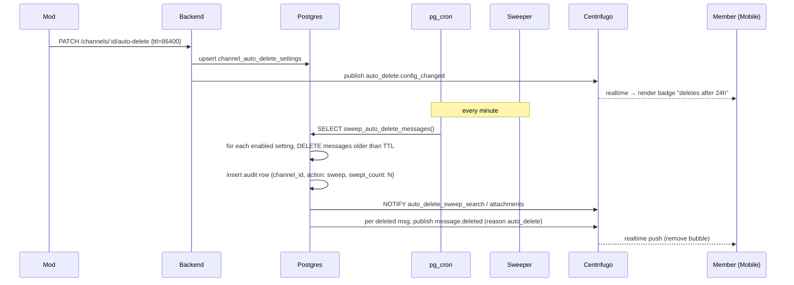

# Auto-Delete Messages — App Flow

## 1. End-to-End Journey



## 2. State Machine

```
[off]
  -- mod sets TTL → [enabled]
[enabled]
  -- mod changes TTL → [enabled (new)]
  -- mod disables → [off]
[enabled]
  -- (sweeper continuously runs)
```

## 3. User Journeys

### J1 — Mod enables auto-delete
1. Mod opens channel settings → security → "Auto-delete messages."
2. Picks 24 hours, leaves pinned + system exemptions on.
3. Saves. Realtime push to all channel members.
4. Header badge updates within 2s.

### J2 — Member sees badge first time
1. Member opens #general.
2. First-time tooltip appears: "This channel auto-deletes messages older than 24 hours. Pinned posts stay."
3. Member taps Got it. Tooltip dismissed forever for this channel.

### J3 — Sweep removes message
1. 24h passes since a non-pinned message was posted.
2. Sweeper deletes it.
3. All connected members receive `message.deleted` event with reason `auto_delete`.
4. Bubble fades out.

### J4 — Mod adjusts TTL down
1. Mod changes 7d → 1d.
2. On next sweeper tick, all messages older than 1d are deleted (could be a large bulk).
3. Audit log records old TTL, new TTL, who, when.
4. Centrifugo publishes config-changed; clients re-fetch.

### J5 — Pinned message preservation
1. Member pins an important post.
2. Sweep runs. Pinned post stays even though it's older than TTL.
3. Mod un-pins. On next sweep tick, the post becomes eligible.

## 4. Edge Cases

- **Concurrent post + sweep:** SKIP LOCKED ensures the in-flight insert is not racing with delete.
- **Channel deleted mid-sweep:** cascade DELETE handles cleanup; settings row gone.
- **Mod loses mod role:** their saved TTL stays; only currently-mod users can change.
- **Permission change mid-edit:** PATCH validates fresh role at request time.
- **Per-message TTL co-existence:** sweeper skips rows with `expires_at IS NOT NULL` (those are handled by `disappearing_messages`).
- **Replies to soon-to-delete messages:** reply remains; quoted message disappears, leaving "(message deleted)" placeholder.

## 5. Background / Async

### Sweeper
- Schedule: pg_cron `* * * * *`.
- Per-channel batch up to 5k.
- Audit row inserted per channel per run, including swept_count.
- Failure: retry next minute.

### Audit-log archiver
- Schedule: monthly. Archives `channel_auto_delete_audit` older than 1 year to R2.

## 6. Notifications

- **Trigger:** mod changes TTL setting.
- **Channel:** in-app system message in the channel: "{mod} set messages to auto-delete after 24 hours."
- **Push:** none (channel members will see realtime + system message).

- **Trigger:** sweep deletes content.
- **No notification** to members (they see the message disappear in-thread).

## 7. Threat-flow appendix

```
What is removed by sweep:
  - non-pinned, non-system messages older than TTL
  - their attachments (Appwrite blobs)
  - their search-index entries

What is preserved:
  - pinned messages (when exempt_pinned=true)
  - system messages (when exempt_system=true)
  - per-message TTL'd messages (handled by disappearing-messages)
  - audit-log row with swept_count

Adversary cannot recover content from:
  - server query after sweep
  - search index after sweep

Adversary may have content from:
  - third-party scrapers running before sweep
  - PITR backup within retention window
  - participant-side caches before realtime delete
```

This map is shipped in the in-product info sheet so mods can communicate retention semantics to their members.
