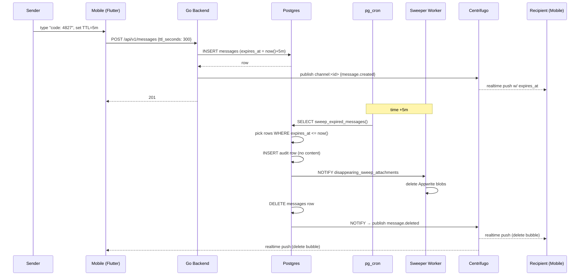

# Disappearing Messages — App Flow

## 1. End-to-End Journey



## 2. State Machine

```
[composing]
  -- pick TTL → [composing_with_ttl]
  -- send → [sent_ephemeral]
[sent_ephemeral]
  -- receive ack → [delivered_ephemeral]
[delivered_ephemeral]
  -- countdown reaches 0 → [pending_delete]
[pending_delete]
  -- realtime delete event → [removed]
  -- realtime missed → [client_self_remove] (defense in depth)
[removed] (terminal)
```

## 3. User Journeys

### J1 — Happy path (send-receive ephemeral DM)
1. Alice types "code: 4827".
2. Taps clock icon, picks "5 minutes".
3. Sends.
4. Bob's client shows the bubble with `⏱ 4:32 left` countdown.
5. Bob reads it. Five minutes pass.
6. Server sweeper runs. Bubble fades on both clients with "(message expired)" placeholder, which itself fades after 5s.

### J2 — Recipient offline at expiry
1. Alice sends 5-minute ephemeral.
2. Bob is offline.
3. Server sweeps at expiry; row gone.
4. Bob comes online.
5. Client fetches recent messages — the row is not there.
6. No "(message expired)" indicator because Bob never had it cached. This is acceptable; if Bob wanted to see expired messages, the feature would not work.

### J3 — Default TTL on DM
1. Alice opens DM settings, picks "Default disappearing: 1 hour."
2. Every subsequent message Alice sends in that DM has TTL=1h preselected.
3. Per-message override still possible (set to "Off" for a single message).

### J4 — Reply to expired message
1. Bob taps an old reply that quoted an expired message.
2. The quote shows "(message no longer available)."
3. The reply itself remains intact unless it too has expired.

## 4. Edge Cases

- **Offline send:** message queued locally with TTL stamp; on reconnect, server computes `expires_at = now() + ttl_seconds` (server time, not client time). Worst case the message has slightly more TTL than expected — acceptable.
- **Permission denied (server disabled feature):** composer hides the clock icon; if user attempts API call directly, 403.
- **Concurrent edit + expiry:** edits are blocked once expiry is < 30s away, to avoid race; edit returns 409.
- **Rate limit hit:** TTL is not considered for rate limiting — same limits as regular messages.
- **Network slow:** countdown uses the message's `expires_at`, never local "send time + ttl." So slow network does not change displayed countdown.
- **Clock skew:** client compares `expires_at` to server-time fetched on connect (via Centrifugo "server_time" extension or `/v1/time` endpoint).
- **PITR restore:** privacy-policy says recovered backups may briefly contain content that has since expired; users acknowledge.
- **Attachment delete failure:** placed on DLQ; nightly orphan-scrub catches stragglers.

## 5. Background / Async

### Sweeper (pg_cron)
- Schedule: `* * * * *` (every minute).
- Function: `sweep_expired_messages()` — deletes up to 5000 rows per run.
- Idempotency: `FOR UPDATE SKIP LOCKED` ensures concurrent runs do not double-delete.
- Failure policy: retry next minute. Lag alert at 5min.

### Attachment-sweeper worker (Go, listens on PG NOTIFY)
- Trigger: `disappearing_sweep_attachments` channel notify.
- Deletes Appwrite objects.
- Failure policy: retry 3× exponential, then DLQ `flicko.dlq.disappearing_attachments`.
- Idempotency key: `disappearing_attach:<message_id>`.

### Search-sweeper worker
- Trigger: `disappearing_sweep_search`.
- Removes Meilisearch doc.
- Failure: retry, DLQ.

### Orphan-scrub worker
- Schedule: `0 3 * * *` (nightly).
- Finds attachments without parent message; deletes blobs.

## 6. Notifications

- **Trigger:** ephemeral DM received and recipient is offline.
- **Channel:** push.
- **Copy:** "{sender} sent a disappearing message" (no content preview).
- **Deep link:** `flicko://dm/<dm_id>`.
- **Batching:** standard message batching.

- **Trigger:** message expired while user is offline.
- **No notification** — silence is correct here.

## 7. Threat-flow appendix

```
Plaintext lifetime:
  client (sender)        : until app process terminates
  network (TLS in transit): bounded
  backend (in-memory)    : milliseconds
  Postgres               : until expires_at + sweep window (≤90s)
  PITR backup            : up to 7d (documented in privacy policy)
  read-replica           : ≤1s after primary delete
  Meilisearch index      : until sweeper-search delete (≤30s after primary)
  Appwrite (attachments) : until attachment-sweeper deletes (≤5min after primary)
  recipient client       : until app cache eviction or message.deleted realtime event

Adversary cannot recover content from:
  the audit log (no content stored)
  the message history endpoint after sweep (row gone)
  database queries (row gone, no soft-delete)

Adversary may recover content from:
  PITR within retention window (legal-hold scenario)
  recipient's client cache before realtime delete fires
  recipient's screenshot or external client
```

This map is shipped in the privacy policy verbatim so users can make informed decisions.
