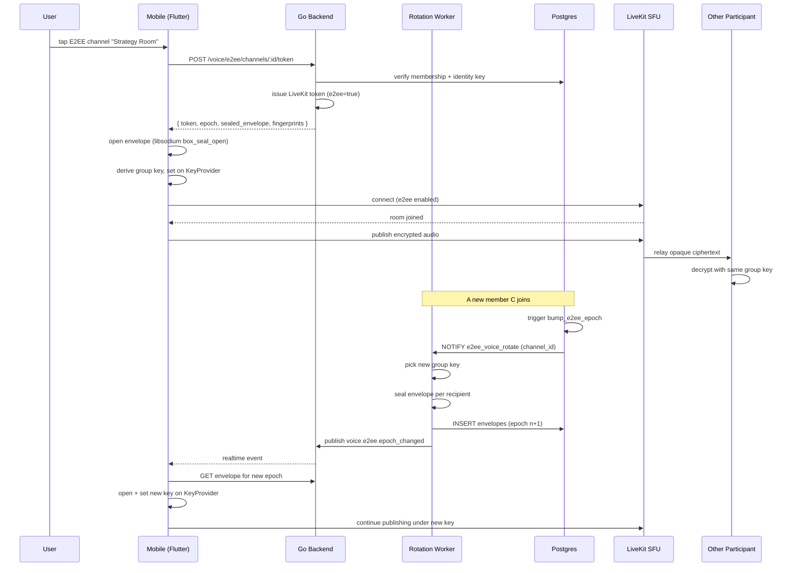

# Encrypted Voice — App Flow

## 1. End-to-End Journey



## 2. State Machine

```
[idle]
  -- user taps E2EE channel → [checking_setup]
[checking_setup]
  -- has identity key → [requesting_token]
  -- no identity key → [identity_setup]
[identity_setup]
  -- identity created → [requesting_token]
  -- cancel → [idle]
[requesting_token]
  -- success → [opening_envelope]
  -- network error → [error]
[opening_envelope]
  -- success → [connecting_sfu]
  -- crypto error → [error_critical] (do not continue unencrypted)
[connecting_sfu]
  -- success → [in_call_encrypted]
  -- failure → [error]
[in_call_encrypted]
  -- epoch event → [rotating]
  -- leave → [leaving]
[rotating]
  -- success → [in_call_encrypted]
  -- failure → [error_critical]
[leaving] -- terminal
[error] -- recoverable; user can retry
[error_critical] -- terminal; do not allow unencrypted fallback
```

## 3. User Journeys

### J1 — Happy path
1. User taps "Strategy Room" (lock icon).
2. Token issued, envelope opened, group key bound.
3. Connection completes. Badge shows green "End-to-end encrypted."
4. Two friends are already in. They hear each other.
5. User leaves; epoch bumps for the rest.

### J2 — First-time user (no identity)
1. User taps E2EE channel.
2. Modal: "Set up encrypted voice — generates an identity that lives only on this device."
3. User taps Continue.
4. Identity-key pair generated locally; public key uploaded; private stays in secure storage.
5. Token request resumes.

### J3 — Member-leave key rotation
1. Three participants in the channel.
2. C disconnects.
3. DB trigger fires; worker generates new group key, seals to A and B (not C).
4. A and B receive the realtime event, fetch new envelope, swap keys.
5. C's old client cannot decrypt anything published after their leave.
6. ≤500ms muted gap during transition.

### J4 — Verification
1. A and B want to verify they're not MITM'd.
2. A taps "verify" on the badge.
3. Sheet shows three codes (A, B, C).
4. A reads "B's code starts with 1b22-77c0" out loud over the call.
5. B confirms her code matches; both mark each other verified.
6. Local-only state — server never knows.

### J5 — Old client tries to join
1. User has Flicko v1.4; channel requires v1.6.
2. On token request, server returns `412 Precondition Failed` with `min_version: "1.6"`.
3. Client shows force-upgrade banner; user updates and retries.

## 4. Edge Cases

- **Offline:** cannot join E2EE channel offline; reconnect resumes flow from idle.
- **Identity key device loss:** identity key is device-bound. New device requires identity-key re-generation, breaking decryption of *future* envelopes only. Document this trade-off.
- **Concurrent join + rotation:** worker uses per-channel mutex; serial epoch numbering.
- **Worker stuck:** members trying to join wait; alert at 30s rotation lag.
- **Decryption failure:** drop audio publish, surface error, never continue unencrypted.
- **Network partition during rotation:** client retries on reconnect; epoch is monotonic so it can re-pull latest envelope.

## 5. Background / Async

### Key-rotation worker
- Trigger: PG NOTIFY `e2ee_voice_rotate` from member-change trigger; admin force-rotate; scheduled rotation every 24h regardless.
- Idempotency key: `e2ee_rotate:<channel_id>:<epoch>`; second invocation for same epoch is a no-op.
- Failure policy: retry up to 5x with exponential backoff. If still failing, mark channel "rotation-stalled" and prevent new joins; existing call drops at 30s.

### Stale-envelope sweeper
- Schedule: hourly.
- Deletes consumed envelopes older than 24h.

### Identity-key garbage-collector
- Schedule: daily.
- Removes unused identity-public-keys for accounts that revoked them.

## 6. Notifications

- **Trigger:** invitation to E2EE channel.
- **Channel:** push.
- **Copy:** "{server name}: {user} is in {channel name} (encrypted)" — never reveals topic.
- **Deep link:** `flicko://server/<id>/voice/<channel_id>`.

- **Trigger:** decryption failures spiking (per-call, client-side).
- **In-call toast:** "Trouble decrypting audio. Rejoin to recover."

## 7. Threat-flow appendix

```
What Flicko sees (server):
  - membership lists (who joined when)
  - call duration
  - sealed envelopes (cannot open them; only recipient can)
  - public identity keys
  - LiveKit-relayed RTP packets (opaque payloads)

What Flicko cannot see:
  - audio content (encrypted by group key not held by server)
  - group keys (live in client memory only)
  - participant private identity keys (in device secure-storage only)

What attackers compromising the server cannot do:
  - decrypt past audio (no keys stored)
  - decrypt future audio without recipient compromise (E2EE)

What attackers compromising one participant can do:
  - decrypt audio from epochs they were in
  - publish further audio in any channel they remain a member of
  - cannot decrypt future epochs once removed (PCS)
```

This appendix is shipped in the privacy policy and the `flicko://settings/privacy/encrypted-voice` info screen so users can read it before joining a sensitive call.
