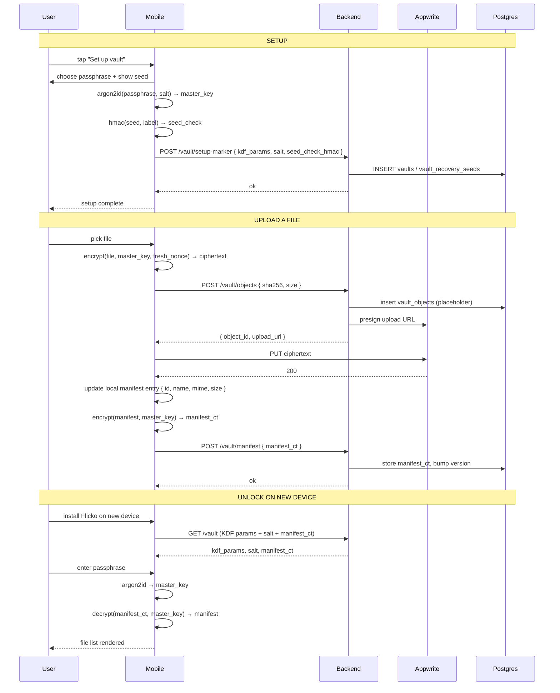

# Private Vaults — App Flow

## 1. End-to-End Journey



## 2. State Machine

```
[no_vault]
  -- setup → [setting_up]
[setting_up]
  -- finish → [locked]
[locked]
  -- unlock → [deriving]
[deriving]
  -- success → [unlocked]
  -- failure → [locked]
[unlocked]
  -- upload → [uploading]
  -- download → [downloading]
  -- idle 5min → [auto_locked] → [locked]
  -- manual lock → [locked]
[uploading]
  -- success → [unlocked]
  -- failure → [unlocked] + error toast
```

## 3. User Journeys

### J1 — First-time setup
1. User taps "Vault" → "Set up vault."
2. Wizard: choose passphrase (8+ chars; entropy meter).
3. KDF runs (~1.5s). Master key derived in memory.
4. Recovery seed shown (24 words).
5. User taps "I've saved them" → verify by typing 3 random indices.
6. Setup complete.

### J2 — Upload a file
1. User taps "+ upload" → picks `IMG_2845.jpeg`.
2. Client encrypts (xchacha20-poly1305 with fresh nonce).
3. Upload to Appwrite via presigned URL.
4. Manifest updated locally; encrypted manifest pushed to backend.
5. Tile appears in list.

### J3 — Cross-device unlock
1. User signs into Flicko on a new phone.
2. Opens Vault → fetches `kdf_params, salt, manifest_ct`.
3. Enters passphrase. KDF derives master key.
4. Manifest decrypts. File list renders.
5. Files download on demand.

### J4 — Forgotten passphrase, recovery seed
1. User forgot passphrase but kept seed.
2. Vault home → "Use recovery seed."
3. Types 24 words. Backend verifies via stored HMAC ("yes, that's the right seed").
4. User sets a new passphrase. Client re-derives with new salt; re-encrypts manifest with new master key.
5. Note: file blobs themselves were encrypted under the OLD master key; we rotate by decrypting with old, re-encrypting with new for each file (background process).

### J5 — Forgotten passphrase, no seed
1. User has no way to recover.
2. App shows "Reset vault" — explicitly destructive: deletes all blobs and manifest.
3. User confirms by typing "DELETE MY VAULT."
4. Vault is gone. New setup possible.

## 4. Edge Cases

- **Auto-lock during upload:** in-flight upload aborts; manifest not updated; user re-unlocks and retries.
- **Decryption failure on one file:** mark tile as broken, surface error, don't break the manifest.
- **Quota near limit:** UI shows usage badge; uploads >limit rejected by backend.
- **Manifest version conflict (two devices):** last-write-wins by version number; show toast "Vault was updated on another device" and re-fetch.
- **Biometric stale:** if Keychain-wrapped key fails to unwrap, fall back to passphrase.
- **Argon2 OOM:** drop to lower-tier KDF, save preference.

## 5. Background / Async

- **Quota recompute worker:** hourly. Reconciles `vaults.used_bytes` from `vault_objects` to fix any drift.
- **Soft-delete purge:** daily. Purges `vault_objects` where `deleted_at < now() - 7d` and corresponding Appwrite blobs.
- **KDF re-keying job (client-side, post passphrase reset):** local-only, walks files, decrypts with old key, encrypts with new, marks each migrated.

## 6. Notifications

- **Trigger:** vault near quota.
- **Channel:** in-app + push.
- **Copy:** "Your vault is at 90% capacity. Free up space?"
- **Deep link:** `flicko://vault`.

- **Trigger:** new device unlocked vault.
- **Channel:** push + email.
- **Copy:** "A new device unlocked your vault."
- **Deep link:** `flicko://settings/security/sessions`.

- **No notification ever includes file metadata.** Push body strictly says "Vault activity."

## 7. Threat-flow appendix

```
Plaintext lifetime:
  user device, while vault unlocked    : in-memory only
  user device, while vault locked       : nothing in memory
  Appwrite (storage)                    : never (ciphertext only)
  Postgres (vault_objects)              : never (only sha + size)
  Postgres (manifest_ciphertext)        : never (encrypted blob)
  Logs                                  : never (we filter at boundaries)
  Backups                               : encrypted blob only

Adversary cannot recover content from:
  full DB read
  Appwrite bucket read
  PITR backup restore
  network capture (TLS + ciphertext)

Adversary may recover content from:
  user's unlocked device (memory or screen)
  user's screen via camera
  user's clipboard if they paste decrypted content elsewhere
```

This map ships in the privacy policy and the in-product info sheet.
