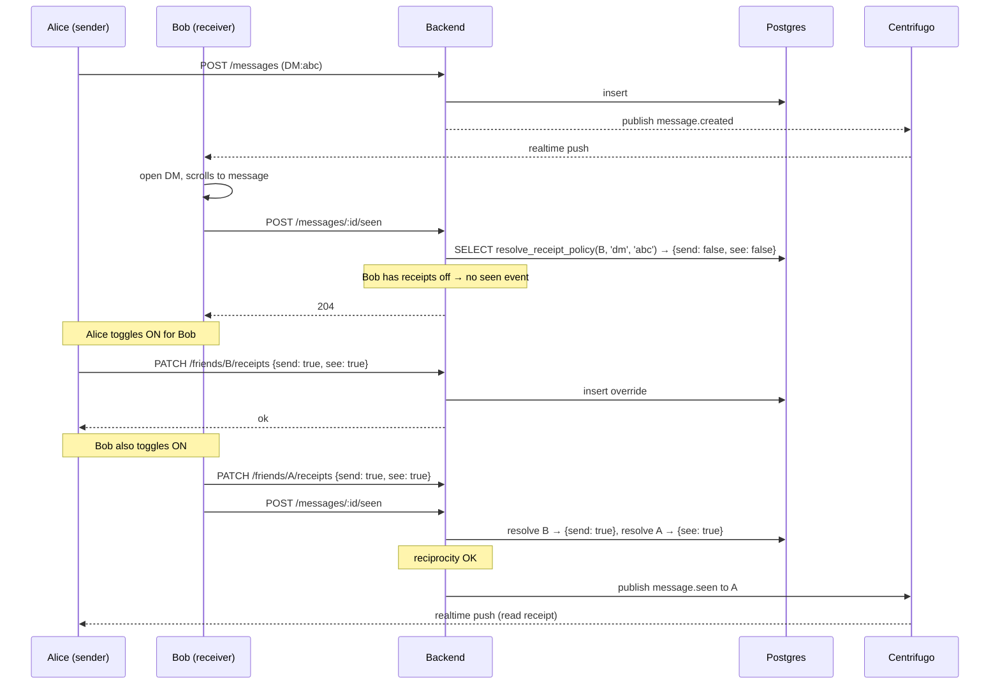

# Read Receipts Control — App Flow

## 1. End-to-End Journey



## 2. State Machine

```
[default_off]
  -- toggle global on → [global_on]
  -- toggle dm on → [dm_override_on]
[global_on]
  -- toggle dm off → [dm_override_off]
[dm_override_on / off]
  -- clear override → [default_off|on]
```

Each scope is independent; precedence: DM > friend > server > global.

## 3. User Journeys

### J1 — First read after migration
1. User reads a DM. Default is off.
2. Toast (one-time): "Read receipts are off by default. Tap to learn more."
3. User dismisses or taps to open settings.

### J2 — Enable for a specific friend
1. Alice opens Bob's profile → Privacy → "Send Bob read receipts: on."
2. Setting saves.
3. Note: Alice will only *see* Bob's receipts if Bob also has reciprocity enabled.

### J3 — Disable in a noisy server
1. User joins a community server with 1000 members.
2. Server settings → "Read receipts: off (default)."
3. Even if user has global on, this server is muted for receipts.

### J4 — Reciprocity asymmetry
1. Alice has receipts on for Bob.
2. Bob has receipts off for everyone.
3. Result: neither sees the other's receipts. Alice sees no read state from Bob.
4. UI shows a subtle "receipts paused" hint when relevant.

## 4. Edge Cases

- **Group DM (3+ members):** each pair resolves independently; multi-recipient seen events filter at publish time.
- **Server with sub-channel granularity:** v1 only has server-level; sub-channel override is v2.
- **Cache lag after toggle:** invalidate immediately; worst case 5min mismatch.
- **User blocks another:** all receipts blocked regardless of toggles.
- **Account deletion:** override rows cascade-delete.

## 5. Background / Async

- **Cache invalidator:** on every override write, publish to Redis pub/sub `receipts:invalidate` so any reading process drops their cache row.
- **Migration job (one-shot):** insert default-off rows for existing users on rollout day.

## 6. Notifications

- **Trigger:** none. Read receipts are a quiet feature. No notifications about receipt state.

## 7. Threat-flow appendix

```
What is observable to the sender:
  - "seen" only when both sides' policies allow it
  - never partially leaked

What is observable to the receiver:
  - their own settings
  - never the sender's policy directly

What is logged:
  - resolved policy at publish time (for observability counters)
  - never the override values per user_id in plaintext logs
```
