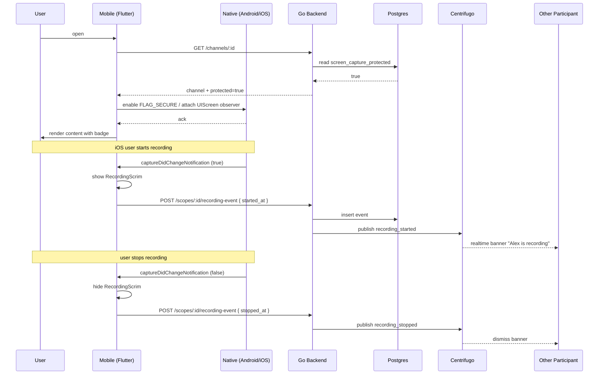

# Screen Capture Protection — App Flow

## 1. End-to-End Journey



## 2. State Machine

```
[unprotected]
  -- enter protected scope → [attaching]
[attaching]
  -- success → [protected]
  -- platform_error → [protection_failed] (block content)
[protected]
  -- recording_detected (iOS) → [scrim_up]
  -- exit scope → [detaching]
[scrim_up]
  -- recording_stopped → [protected]
  -- exit scope → [detaching]
[detaching]
  -- success → [unprotected]
[protection_failed]
  -- user retries → [attaching]
```

## 3. User Journeys

### J1 — Mod enables protection
1. Mod opens channel settings → security → toggle "Screen-capture protection."
2. Confirmation dialog explains scope and limits.
3. Mod confirms; flag flips. All channel members get realtime update; on next render, badge appears.

### J2 — DM consent flow
1. Alice toggles protection in DM with Bob.
2. Bob receives system message + push: "Alice wants to enable capture protection for this DM."
3. Bob taps Accept. Flag flips. Both clients enable native protection.
4. If Bob declines, the request expires after 7 days.

### J3 — iOS recording detection
1. Alice opens a protected channel on iPhone.
2. Alice swipes Control Center, taps Record.
3. Within 500ms, RecordingScrim covers the screen.
4. The other participants see "Alice is recording the screen" banner.
5. Alice stops recording. Scrim fades out. Banner dismisses.

### J4 — Android screenshot attempt
1. Bob takes screenshot in protected channel on Android.
2. OS captures black image (FLAG_SECURE behavior).
3. Toast appears: "Couldn't take screenshot. App restricted." (System toast — not us.)
4. Other side never sees a "screenshot detected" event because Android does not surface it.

### J5 — Rooted device
1. Bob has a rooted Android. Custom ROM bypasses FLAG_SECURE.
2. Bob takes a screenshot successfully.
3. We cannot detect this. Banner says "we cannot enforce on rooted devices" but only when integrity check trips.

## 4. Edge Cases

- **App backgrounded:** FLAG_SECURE stays attached so the app-switcher snapshot is hidden.
- **Multi-window (Android):** flag still respected.
- **Picture-in-picture:** disabled in protected scope.
- **Cast/AirPlay:** detected like recording on iOS; scrim engages. On Android, FLAG_SECURE prevents external display rendering.
- **Plugin attach failure:** content stays hidden until retried; user gets clear error.
- **Scrim flicker on transition:** debounce captureDidChange to avoid 50ms flickers.

## 5. Background / Async

- **Recording-event audit pruner**: cron `0 4 * * *` daily, deletes events older than 90d.
- **Stale-consent cleaner**: cron `0 5 * * *` daily, deletes consent rows older than 7d if not all parties consented.

## 6. Notifications

- **Trigger:** recording detected.
- **Channel:** in-app banner; no push (the recording user already knows).
- **Copy:** "{name} is recording the screen."
- **Deep link:** to the channel/DM.
- **Batching:** dedupe within 30s.

- **Trigger:** consent request.
- **Channel:** push + in-app.
- **Copy:** "{name} wants to enable capture protection for your DM."
- **Deep link:** the DM.

## 7. Threat-flow appendix

```
What is blocked / detected:
  Android screenshot      : blocked (black image)
  Android screen-record   : black-frame output
  Android app-switcher    : blank tile
  iOS screen-record       : detected → scrim hides content
  iOS AirPlay/cast        : detected → scrim
  iOS app-switcher        : blurred (default OS)

What is NOT blocked (user-facing copy):
  External camera photographing screen
  Rooted/jailbroken devices bypassing OS flags
  Web client (no native flag)
  Accessibility-service text scraping
  Memory dumps from compromised devices
```

This map ships in the in-product info sheet so users can decide whether the feature meets their threat model.
