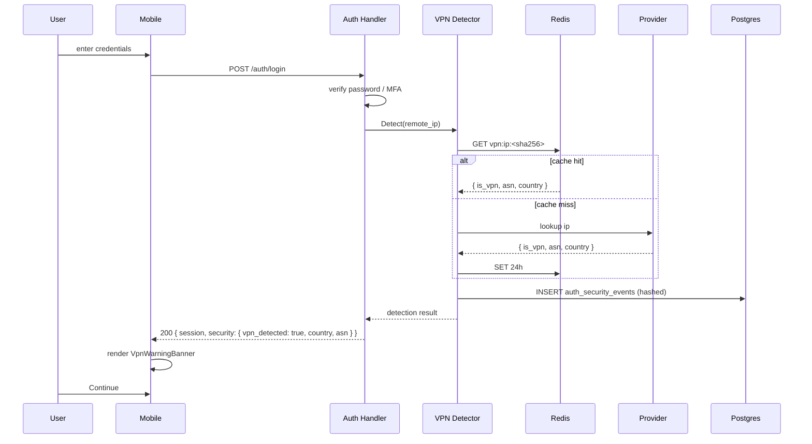

# VPN Detection — App Flow

## 1. End-to-End Journey



## 2. State Machine

```
[idle]
  -- login submit → [authenticating]
[authenticating]
  -- success + vpn_signal → [warning_shown]
  -- success + no_signal → [authenticated]
  -- failure → [auth_error]
[warning_shown]
  -- continue → [authenticated]
  -- explain → [explainer_open]
[explainer_open]
  -- close → [warning_shown]
[authenticated] (terminal for this flow)
```

## 3. User Journeys

### J1 — Happy path (no VPN)
1. User logs in; provider says "clean."
2. No banner. They proceed normally.

### J2 — VPN-using user
1. User on NordVPN logs in.
2. Login succeeds. Banner appears: "Your connection looks like it's via a VPN."
3. User taps Continue. Session proceeds.
4. Settings → security shows session marked "VPN."

### J3 — Detection unavailable
1. Provider quota exhausted; both providers down.
2. Login proceeds. No banner. Detection logged as "unavailable."
3. T&S dashboard sees a gap; resolves automatically next cycle.

### J4 — User wants to investigate
1. User taps "Why am I seeing this?"
2. Explainer sheet describes what we store.
3. User dismisses, continues.

### J5 — Legitimate user, suspicious lookup
1. User is on a hotel WiFi that looks like a hosting provider.
2. Banner appears (false positive).
3. User taps Continue; no harm done.

## 4. Edge Cases

- **Repeat login from same IP within 24h:** cached; same banner state.
- **IPv6 vs IPv4 dual-stack:** detected separately; if both show VPN, use the more specific signal.
- **Behind corporate proxy:** likely flagged; document for enterprise users.
- **IP rotates mid-session:** session not re-checked; we only check at login/signup boundary.
- **Provider returns malformed data:** treat as detection_source=unavailable.

## 5. Background / Async

- **Salt rotator:** cron `0 0 * * *` daily — inserts new salt; old salts older than 30d removed.
- **Cold-archive worker:** weekly export of `auth_security_events` older than 180d to R2.

## 6. Notifications

- **Trigger:** new login from VPN+new-device combination.
- **Channel:** push + email.
- **Copy:** "Heads up — a new sign-in from {country} via {asn_org}. If this wasn't you, change your password."
- **Deep link:** `flicko://settings/security/sessions`.
- **Batching:** dedupe within 6h.

## 7. Threat-flow appendix

```
What we store about a login:
  - hashed IP (SHA-256 with daily-rotated salt)
  - /24 or /48 prefix for analytics aggregation
  - ASN number + organization name
  - country code (ISO-3166)
  - vpn/proxy/tor/hosting flags
  - user agent
  - timestamp

What we never store:
  - raw IP address
  - geolocation finer than country
  - browser fingerprints

What we use this data for:
  - showing the user their own session history
  - T&S abuse correlation (post-incident; not pre-emptive blocking)
  - aggregate analytics (country distribution, VPN prevalence)

What we never do with this data:
  - auto-block accounts
  - rate-limit or shadow-ban based on VPN signal alone
  - sell, share, or grant access to advertisers
```

This map is reproduced in the privacy policy and the explainer sheet.
