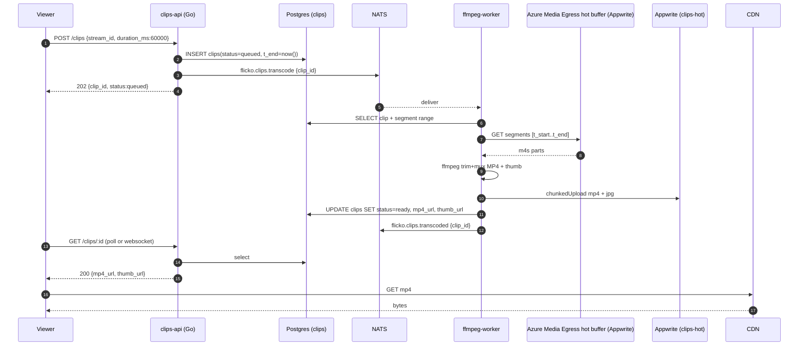
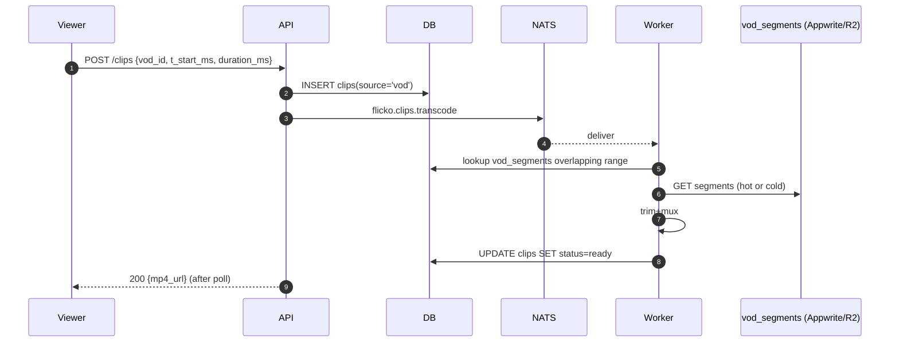
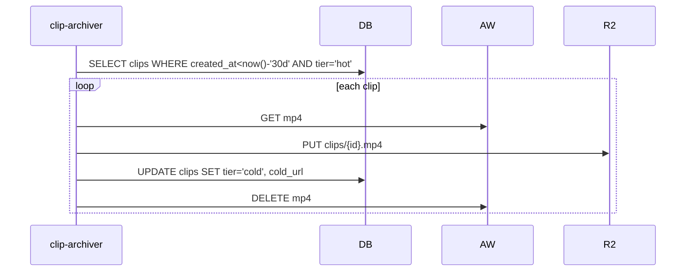

# Clips System — App Flow

## Sequence: viewer clips a live moment



## Sequence: viewer clips from a finished VOD



## Sequence: cold archive after 30 days



## State Machine: clips.status

```
                       +---------+
                       | queued  |
                       +----+----+
                            |
                            | worker picks up
                            v
                       +----+----+
                       |rendering|
                       +----+----+
                  fail  |       | success
              +---------+       +---------+
              v                           v
         +----+----+               +-------+--+
         | errored |               |  ready   |
         +----+----+               +-----+----+
              |                          |
              | manual retry             | tier flip
              v                          v
         (back to queued)         +------+---+
                                  | archived |
                                  +-----+----+
                                        |
                                        | owner delete or moderation
                                        v
                                  +-----+---+
                                  | removed |
                                  +---------+
```

`removed` is terminal; the row is kept so reports remain auditable, but `mp4_url` and `cold_url` are nulled and the public page returns 410 Gone.

## State Machine: clip moderation

```
       reported  --first report-->  pending_review
                                          |
                          mod approves    | mod removes
                                  v       v
                           dismissed   removed
```

`removed` here mirrors the clips.status `removed` and is the only way mod action propagates.

## Edge Cases

1. **Viewer clicks Clip while stream is buffering**: API still records `t_end=now()` server-side, so the clip range matches actual server time, not the viewer's drift.

2. **Source segments not yet flushed to Appwrite (last 0-6 s)**: worker polls Appwrite up to 8 s for the missing tail segment. If it never arrives, it trims to the available end and adjusts `duration_ms`.

3. **Two viewers clip overlapping ranges**: each clip is independent; we do not dedupe. The worker may use a shared segment cache to avoid re-downloading the same m4s.

4. **Stream ends mid-clip-window**: e.g., viewer clicks Clip 30 s but stream ended 10 s ago. We allow it as long as the source range is still in the egress buffer (5 min) or in a recently-finalized VOD.

5. **Clip from a private VOD by a non-creator**: API rejects with 403. RLS enforces.

6. **Worker stuck > 30 s**: NATS consumer redelivery kicks in; first worker's exclusive lock on `clip_id` (advisory lock) prevents double upload. Original is allowed to finish but its result is discarded if a duplicate already wrote `mp4_url`.

7. **Reencoded vs copy mode mismatch**: copy mode requires t_start to be at an IDR. The worker computes IDR positions from the m4s init segment; if t_start is < 1 s from an IDR, we round to the IDR. Otherwise we reencode for sample-accurate trim.

8. **Long clip 300 s on slow worker**: worker reports progress to DB every 5 s; mobile poll shows progress %. SLO does not apply for clips > 120 s, but we still target < 25 s.

9. **Clip removed while being watched in feed**: client sees `410 Gone`, transitions to next clip with a "This clip was removed" overlay for 800 ms.

10. **Rate limit hit (5 clips/min/viewer)**: API returns 429 with `retry_after`. Sheet displays "Slow down — you can clip again in 12 s."

11. **Reporter is the clip's creator**: legal flow allows self-report (e.g., uploaded mistakenly). Treated like a delete.

12. **Stream goes private mid-clip**: queued clips from when the stream was public are still allowed to render and be saved. New clip requests after privacy flip are rejected with 403.

13. **TikTok deep link share fails (no app installed)**: fall back to `tiktok.com/upload` with the mp4 URL pre-filled where supported, else copy link.
