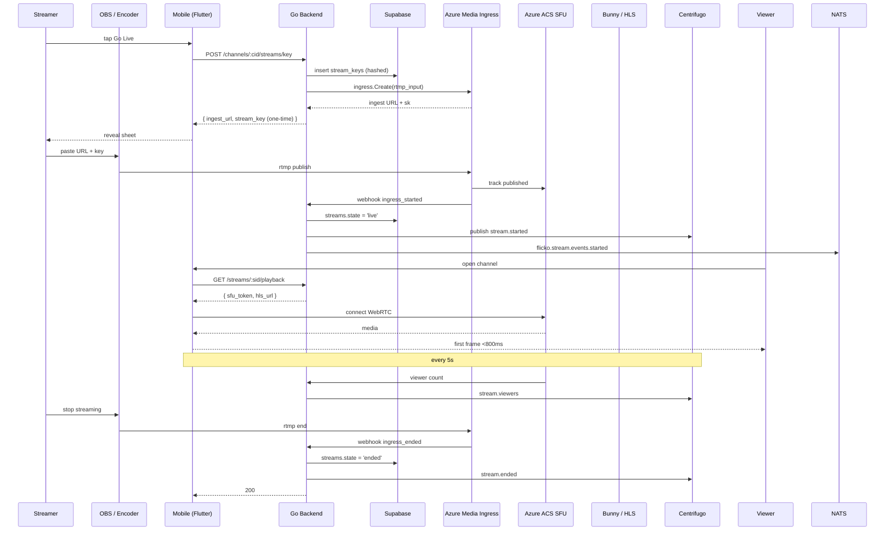

# Native RTMP Streaming — App Flow

## 1. End-to-End Journey



## 2. State Machine

```
[idle]
  └── createIngress ──► [pending]
                          ├── ingress_started ──► [live]
                          │                         ├── 5s no media ──► [paused]
                          │                         │                     └── media ──► [live]
                          │                         ├── ingress_ended ──► [ended]
                          │                         └── moderator kill ──► [revoked]
                          └── timeout 15m       ──► [errored]
```

Idempotent transitions; webhook handler upserts on `(stream_id, kind, occurred_at)`.

## 3. User Journeys

### J1 — Happy path (broadcaster)
1. Streamer taps Go Live in `#after-hours`.
2. Setup sheet appears; region defaults to nearest by RTT.
3. Streamer copies ingest URL + key into OBS, hits Start Streaming.
4. State flips to `live` within 4 s; setup sheet collapses; bitrate chart starts.
5. Stream ends cleanly when OBS disconnects; toast offers "Save VOD" if `vod-storage` is on.

### J2 — Viewer happy path
1. Viewer opens the channel; live banner is already pulsing.
2. Player attempts SFU first; if first frame >1.5 s, falls back to LL-HLS.
3. Chat overlay loads in parallel; donation alerts arrive over `stream-chat:<id>`.

### J3 — Encoder dropped
1. Bitrate hits 0 for 5 s; state moves to `paused`.
2. UI shows "We lost the feed" inline banner without unmounting the player.
3. If encoder reconnects within 60 s, state returns to `live`. Otherwise after 60 s the stream is ended.

### J4 — Key leak
1. Two encoders publish with the same key.
2. The first publish is honoured; the second is rejected at Azure Media Ingress.
3. Backend service receives the duplicate-publish webhook, auto-rotates the key, force-disconnects all publishers, and notifies the owner via push.

### J5 — Moderator kill
1. Server admin opens Stream View ⋯ → "End stream".
2. Confirmation modal — destructive copy: "This ends the stream for everyone."
3. Backend revokes the key, calls `LK.Ingress.Delete`, marks state `revoked`.
4. Centrifugo emits `stream.ended`, all viewers see "Stream ended" overlay.

## 4. Edge Cases

- Offline: Go Live disabled; tooltip "Reconnect to start streaming".
- Permission denied: Go Live affordance hidden if user lacks `stream.publish`.
- Stale data: viewer state pulled from Centrifugo with 30 s reconnect backoff.
- Concurrent edits: title updates use last-write-wins; bitrate updates always from broadcaster session only.
- Rate limit hit: backend returns 429 with `Retry-After`; UI surfaces a sheet "Slow down — try again in {n} s".
- Network slow on viewer: ABR drops to 480p automatically; manual override available in player ⋯.

## 5. Background / Async

- `health_worker` ticks every 15 s — reconciles `streams.state` with Azure Media Ingress; idempotency key `stream:<id>:tick:<minute>`.
- Webhook retries: Azure ACS retries 5 times with backoff; we accept duplicates because each row is keyed by `(stream_id, kind, occurred_at)`.
- Cleanup cron `0 */1 * * *` — kills `pending` rows older than 15 min and revokes their stream keys.
- Failure policy: 3 retries with exponential backoff, then DLQ subject `flicko.stream.events.dlq`.

## 6. Notifications

- Trigger event: `stream.started` for users who follow the broadcaster.
- Channel: push (FCM / APNs) and in-app.
- Copy: "{username} is live in {channel}".
- Deep link: `flicko://stream/<id>`.
- Batching rule: max 1 push per follower per broadcaster per 30 min.
- Quiet hours respected per user setting.
