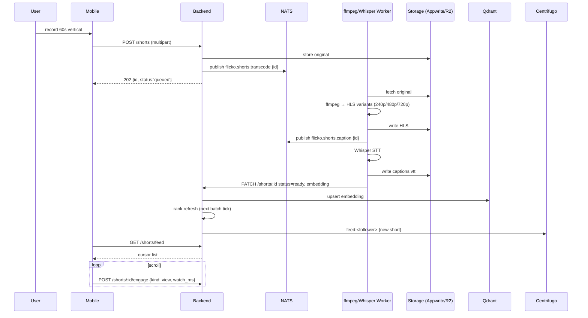

# Short Videos — APPFLOW



## State Machine
```
[uploaded] → [transcoding] → [captioning] → [ranking] → [ready]
[any]      → [blocked]   (NSFW or DMCA fingerprint match)
[any]      → [removed]   (mod or author)
```

## Edge Cases
- Upload too long: client trims to 60s; reject server-side if >65s.
- Network drop mid-upload: tus-style resumable.
- Battery dies during recording: drafts in Hive every 2s.
- DMCA hit: status → blocked; author notified with reason.
- Repost detection: audio fingerprint match → flag in mod queue.
- Watching without account: limited public feed only.

## Background
- Ranker: every 5 min recomputes top-N per cohort.
- Cold-archive sweeper: daily moves 30d+ to R2.
- Engagement aggregator: rollup `view_count`, `like_count` from engagements every 60s.

## Notifications
- "@alice posted a new short: 'sunday vibes'" (followers, batched 1/15min/poster).
- Deep link `flicko://shorts/<id>`.
- Admins of server: "New short pending review" if mod-queue mode.
