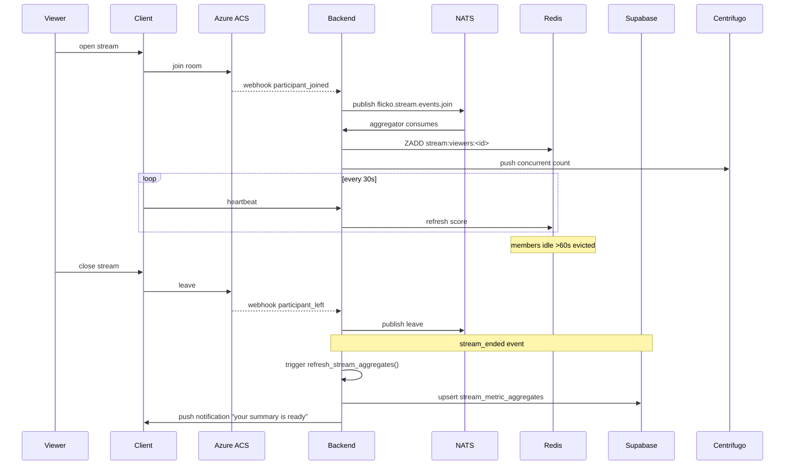

# Stream Analytics — APPFLOW



## State Machine
```
[live] -> [aggregating] (on stream_ended)
[aggregating] -> [ready] (after MV refresh)
[ready] -> [archived] (30d)
```

## Edge Cases
- Viewer flapping (join/leave repeatedly): debounce — count as 1 unique.
- Stream crashes: detect via missing heartbeat 30s; mark ended.
- Late events post-end: queue 5 min then drop.
- Privacy: user opts out → counted as anon (no user_id).

## Background
- pg_cron `*/5 * * * *` MV refresh.
- pg_cron `0 3 * * *` partition rotate raw events.
- NATS consumer durable name `stream-analytics`.

## Notifications
- "Your stream summary is ready" push 60s after end.
- Deep link: `flicko://stream/<id>/analytics`
