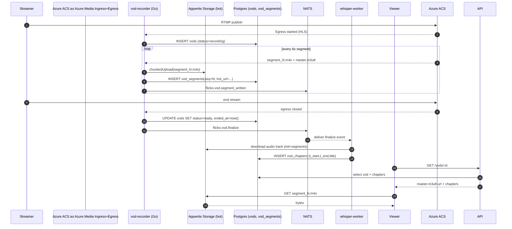
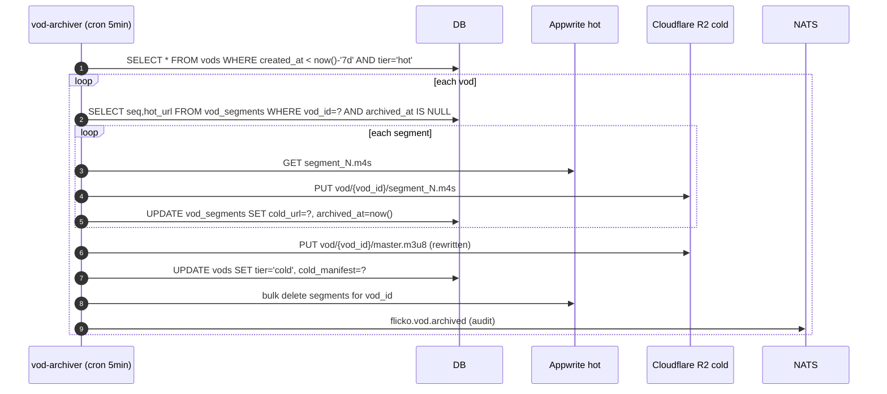

# VOD Storage — App Flow

## Sequence: live stream produces a VOD



## Sequence: hot -> cold archive after 7 days



## State Machine: vods.status

```
        +------------+     egress started      +-----------+
        |            | ----------------------> |           |
   ---> |  pending   |                         | recording |
        |            | <---------------------- |           |
        +------------+    egress aborted       +-----+-----+
                              ^                      |
                              | retry                | egress closed
                              |                      v
                       +------+--------+       +-----------+
                       |  errored      | <---- | finalizing|
                       +------+--------+ fail  |           |
                              ^                +-----+-----+
                              | manual                |
                              |                       v
                              |                 +-----+-----+
                              +-----------------|   ready   |
                                                +-----+-----+
                                                      |
                                                      | tier flip
                                                      v
                                                +-----------+
                                                |  archived |
                                                +-----+-----+
                                                      |
                                                      | creator delete
                                                      v
                                                +-----------+
                                                |  deleted  |
                                                +-----------+
```

Allowed transitions only. Any other attempted transition raises `vod_invalid_state` and is rejected.

## State Machine: vod_segments

```
   pending  --upload ok-->  hot  --archive ok-->  cold  --purged-->  gone
       \                     |                      |
        \-- upload fail ---> errored                |
                             ^                      |
                             |--archive fail--------+
```

A `gone` segment is one whose row remains for accounting but the bytes are deleted (e.g., creator soft-delete grace expired).

## Edge Cases

1. **Egress crash mid-stream**: `vod-recorder` watches NATS heartbeat from Azure ACS. If gap > 30 s, it inserts a sentinel `vod_segments` row with `is_gap=true`. On finalize, status flips to `ready` regardless. Player reads `is_gap` and inserts an HLS discontinuity.

2. **Creator deletes during recording**: status moves `recording -> errored`, the recorder swallows further segments, and a tombstone is written. The R2 archiver skips errored VODs.

3. **Appwrite chunkedUpload returns 429**: recorder buffers the segment in-memory (max 4 segments, ~16 MB) and retries with exponential backoff up to 30 s. If all retries fail, the segment is marked `is_gap=true`.

4. **Whisper transcription times out (>3x stream length)**: chapters are skipped, `vods.chapters_status='skipped'`. The UI hides the chapter rail and offers "Generate chapters" button which re-enqueues the job.

5. **Two viewers request a VOD that just finalized**: both hit the master manifest endpoint, which is cached at the edge for 5 s. The first miss blocks until the manifest builds; the second is a hit.

6. **Cold archive partially fails (e.g., 100/200 segments archived)**: cron is idempotent; next pass picks up only segments where `archived_at IS NULL`. The hot tier deletion only fires when 100% of segments have `archived_at`.

7. **Subscriber-only VOD viewed by non-subscriber**: backend returns 402 with body `{required: 'subscription', tier: 'aria-tier-1'}`. Mobile interprets and shows the paywall sheet.

8. **GDPR delete request on cold tier**: API sets `vods.deleted_at`, queues `flicko.vod.purge`. Worker deletes R2 objects, then sets `vods.purged_at`. The row is kept indefinitely for audit.

9. **Stream is muted (DMCA)**: a moderator endpoint can mute a time range; `vod_segments` get a `muted=true` flag and the player swaps to a silent audio track during that range while keeping video.

10. **Player on iOS Low Power Mode**: AVPlayer auto-selects 480p; HLS master uses bandwidth signaling so this is automatic. We log `quality_selected` for analytics.
