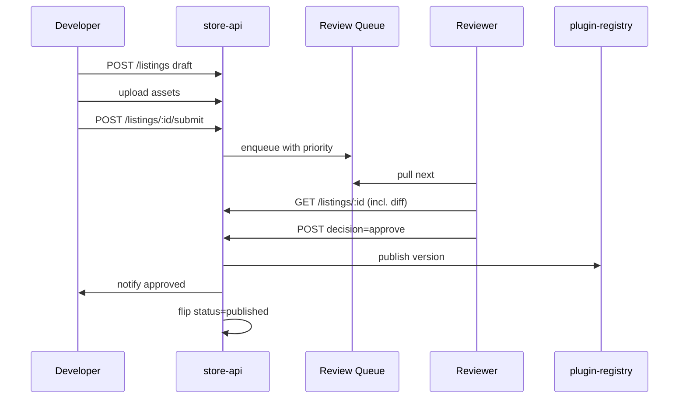
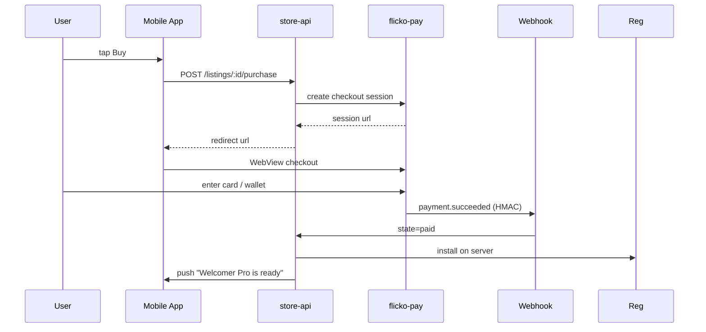
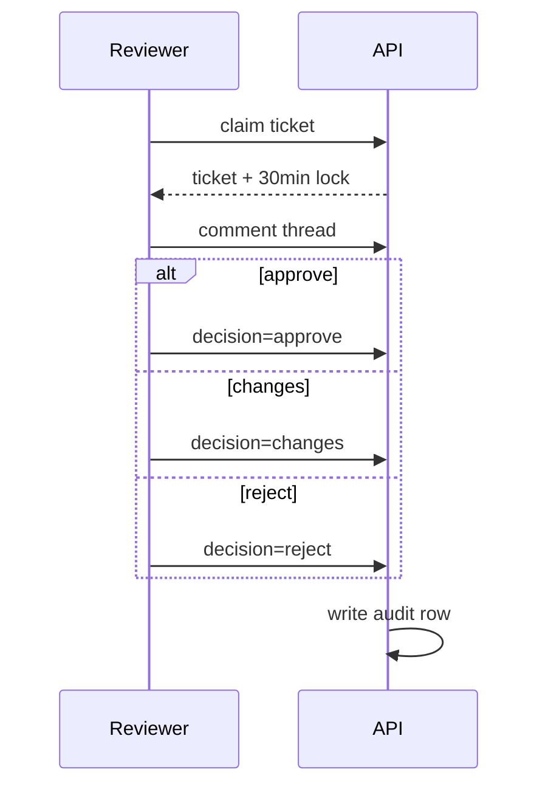
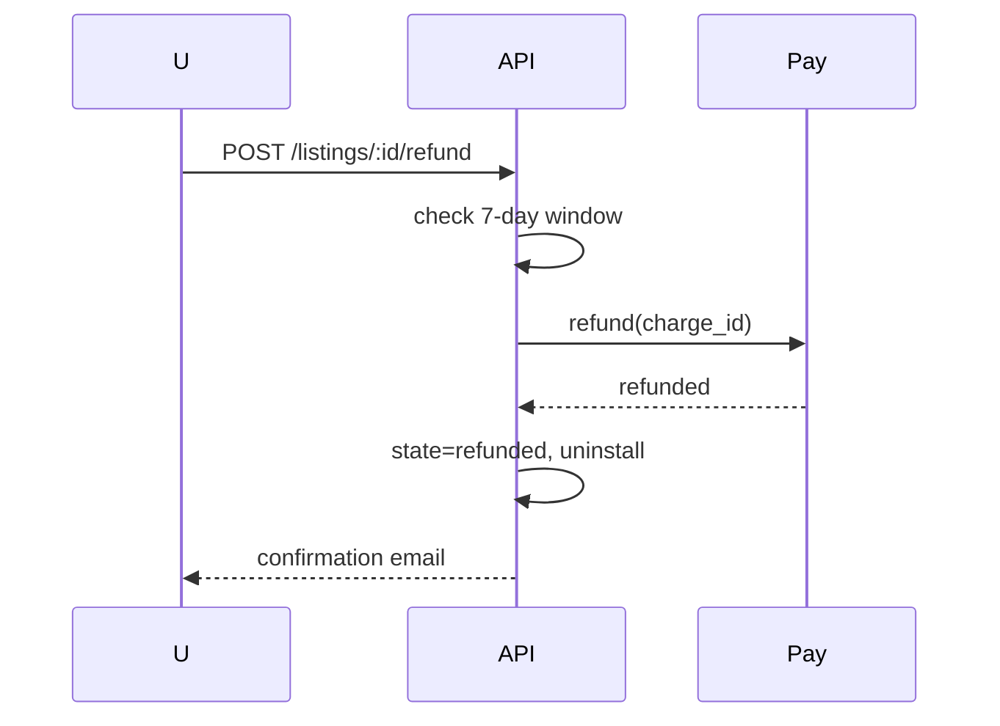

# APPFLOW: App & Theme Store

## Submit -> Review -> Publish


## Purchase Flow (Paid)


## State Machines

### Listing
```
draft -> submitted -> in_review -> [approved -> published] | [changes_requested -> draft] | [rejected -> draft]
published -> taken_down (manual)
published -> deprecated (creator)
```

### Purchase
```
pending -> [paid -> installed] | [failed -> retry|abandoned]
paid -> refund_requested -> refunded
installed -> uninstalled (does not refund)
```

### Subscription
```
trialing -> active -> [canceled at period end -> ended] | [past_due -> active|canceled]
```

## Edge Cases
- Listing approved but plugin-registry install fails: purchase stays `paid`, retried 5 times with backoff, then auto-refunded.
- Currency mismatch between user wallet and listing: convert at Stripe FX, shown clearly before confirm.
- Refund after 7 days: self-serve disabled, contact support flow opens with prefilled order id.
- Subscription card expires: 3 attempts over 7 days, grace period continues plugin, then disables and emails owner.
- Reviewer assigned but inactive: SLA timer triggers reassignment after 4 h.
- Capability escalation in update: 2-reviewer rule, both must approve, audit row stores both ids.
- Asset takedown after publish: status flips `taken_down`, existing installs continue with last good version, no new buyers.

## Reviewer Workflow


## Refund Flow

