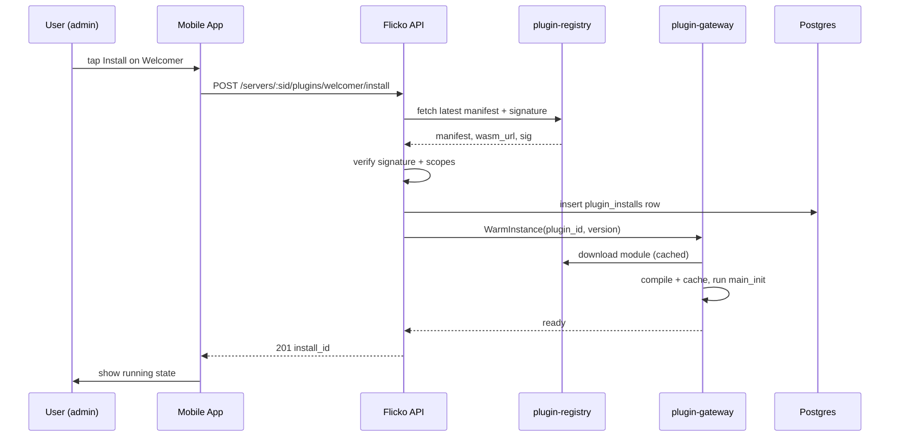
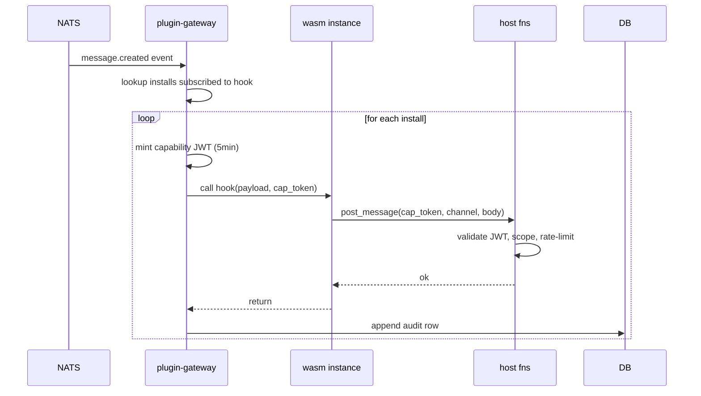
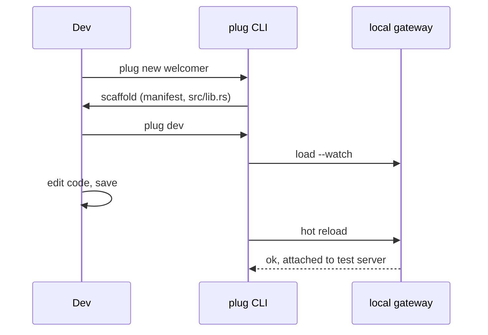

# APPFLOW: Plugin System

## Install Flow (Mermaid)


## Hook Invocation Flow


## State Machine: Plugin Install
```
              install
   [absent] ----------> [installing]
                           |
                           | manifest_ok + warm_ok
                           v
   [degraded] <-- error -- [active] -- toggle off --> [disabled]
       |                     ^                            |
       | retry success       |  toggle on                  |
       +---------------------+                            |
                                                          |
                        uninstall (any state) -> [absent]
```
Transitions:
- installing -> active: warm succeeds.
- active -> degraded: 3 consecutive crashes within 60 s, or fuel exceeded 10 times in 5 min.
- degraded -> active: exponential backoff probe succeeds.
- any -> absent: uninstall request from owner or admin kill switch on whole plugin id.

## Edge Cases
- Manifest changes scopes on update: install pinned to old version, owner sees banner "Welcomer 1.5.0 wants new permissions. Review."
- Network drop during install: install row stays in `installing` for max 60 s, then GC reaper marks `failed`, client retries idempotently with `Idempotency-Key`.
- Plugin publisher revoked: gateway flips disabled flag, all instances evicted within 2 s, server admins get push notification.
- Mobile app offline: hooks queue server-side; mobile UI shows last-synced timestamp, no local invocation.
- Two admins toggle simultaneously: optimistic lock via `updated_at`, second write returns 409, UI refetches.
- Plugin emits 100 messages: rate limiter (10/s) drops excess, audit row marks `rate_limited=true`, no crash.

## Developer Loop

