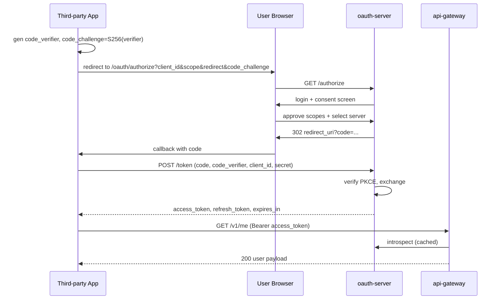
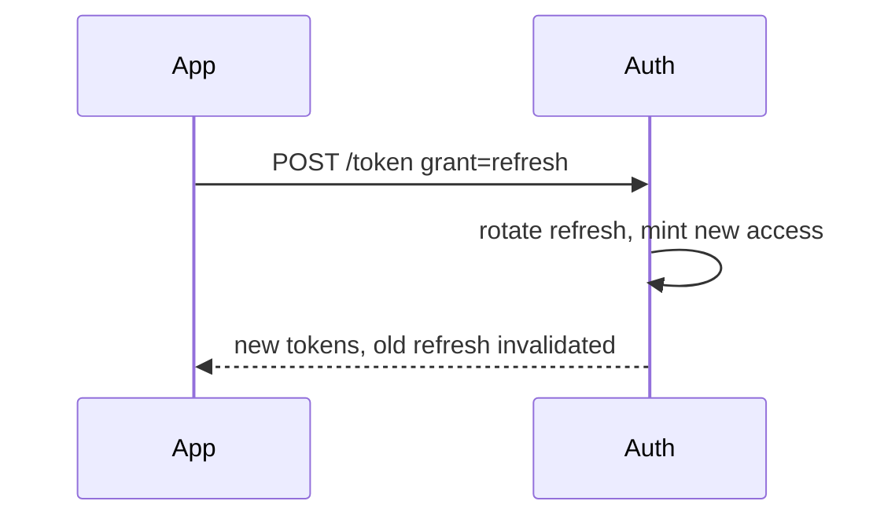
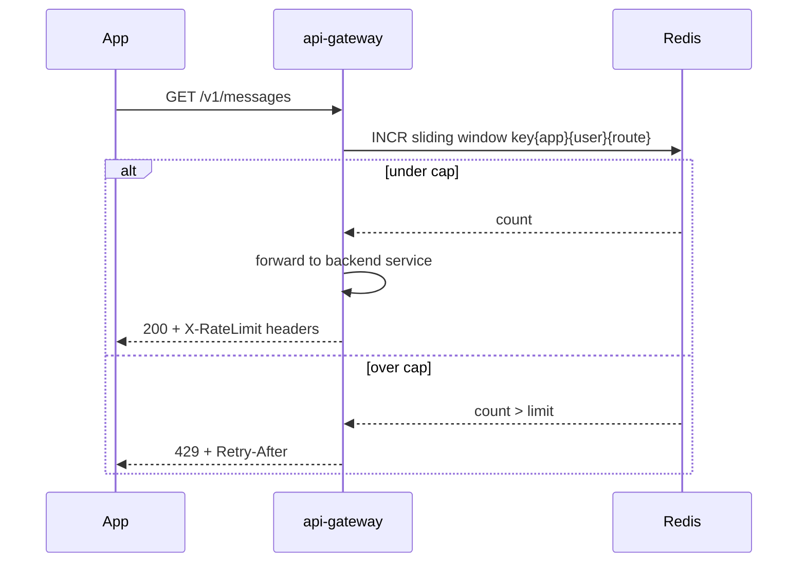
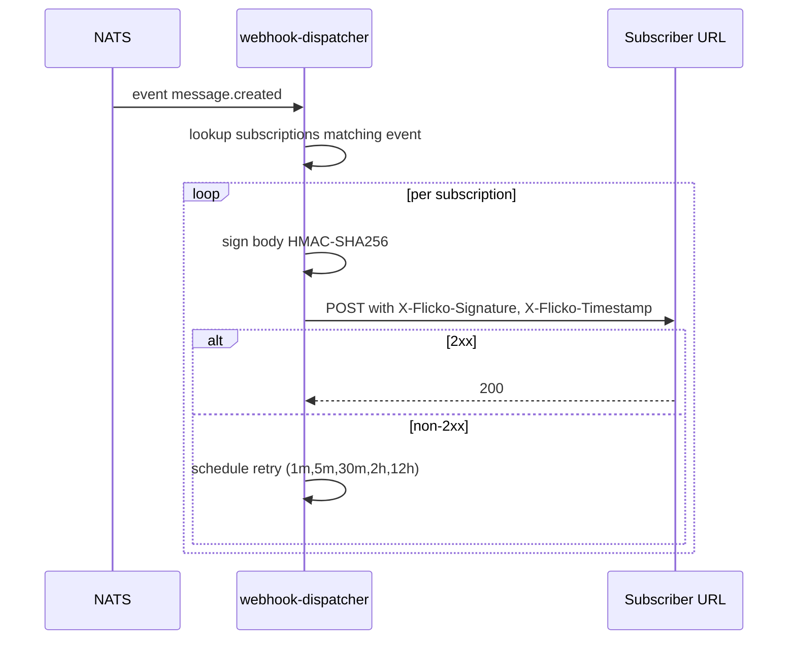

# APPFLOW: Public REST API

## OAuth Authorization Code + PKCE


## Refresh


## Rate Limit Decision


## Webhook Delivery


## Versioning State
```
client default = first call's API version
explicit header = override per request
deprecated version = adds Sunset header 6 mo before removal
removed version = 410 Gone with link to migration doc
```

## Token Lifecycle
```
created -> active -> [refreshed -> active'] | [revoked -> dead] | [expired -> dead]
revoked: server-side blacklist row in api_tokens.revoked_at, propagated to gateway via Postgres LISTEN within 1 s.
```

## Edge Cases
- Clock skew on PKCE check: tolerance 60 s.
- Redirect URI mismatch: refuse with `invalid_redirect_uri` and log to security audit.
- Concurrent refresh: refresh tokens are single-use; second use marks family compromised, all tokens in family revoked, owner emailed.
- API token rotation: dual-active window 24 h with both tokens valid.
- Webhook receiver flaps: circuit breaker after 50 consecutive failures, suspends subscription with notification.
- Idempotency-Key reuse with different body: returns 409 with `idempotency_conflict`.
- Scope downgrade mid-session: token still valid until expiry; new requests beyond removed scope return 403 with `scope_required`.
- 429 inside a 200-batch endpoint: per-item failures returned in batched response, top-level 200 retained.

## Sandbox Auth
- Tokens prefixed `flk_test_` route to a separate read-only mirror DB.
- Test webhook receiver provided at `/sandbox/webhooks/inbox` with viewable history for 1 h.
