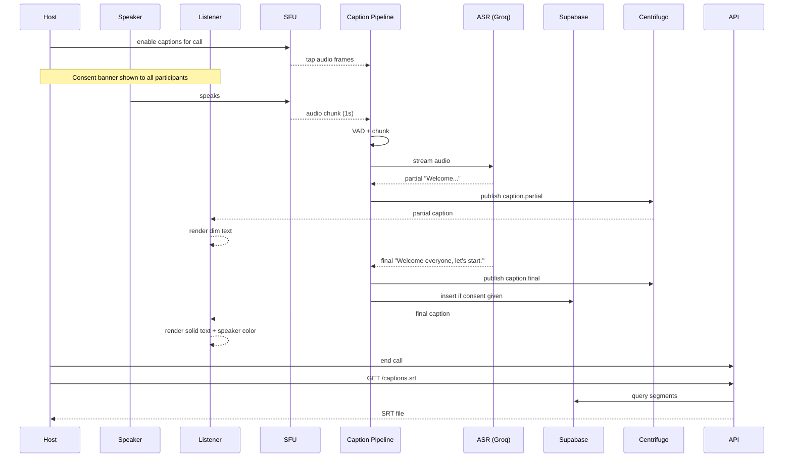

# Captions for Voice/Video — App Flow

## 1. End-to-End Journey



## 2. State Machine

```
[idle]
   │ host enables captions
   ▼
[starting]
   │ ASR ready, consent shown
   ▼
[active]
   │ ASR partial
   ▼
[partial-rendering]
   │ ASR final
   ▼
[active]   (loop)

[active] -- ASR error --> [reconnecting]
[reconnecting] -- recover --> [active]
[reconnecting] -- give up --> [error]
[active] -- host disables --> [stopping]
[stopping] -- flushed --> [idle]
```

## 3. User Journeys

### J1 — Happy path: deaf participant follows a voice call
1. Devon joins voice channel "Standup".
2. Host has captions enabled at server level.
3. Consent banner appears at top of call: "Captions are on".
4. Asha speaks; partial caption appears within 1 s; final within 2 s.
5. Devon reads, occasionally corrects context with text chat.
6. End of call → host taps "Save SRT", file downloads.

### J2 — Listener-only opt-in
1. Listener has caption pref enabled but server has captions OFF for the call.
2. UI shows "Captions unavailable in this server" and disables the CC button with explanation.

### J3 — ASR error recovery
1. Mid-call, Groq endpoint throttles.
2. Captions show "Reconnecting…"; live region announces it.
3. Pipeline switches to faster-whisper backup; captions resume after ~3 s.

### J4 — User repositions captions
1. User drags caption pane to top.
2. Position pref saved; persists across calls.

### J5 — SRT export gated by consent
1. Some participants joined as "Guest" without consenting to persistence.
2. Their caption segments are not persisted (in-memory only).
3. SRT export contains only consenting speakers' lines, with a note explaining gaps.

## 4. Edge Cases

- **Speaker on phone (poor mic):** WER spikes; captions show partial in italic.
- **Multiple simultaneous speakers:** captions interleave by speaker name; the most recent final is shown solid, prior partial dimmed.
- **Music playing:** ASR may transcribe lyrics; we tag `[music]` heuristically when audio is detected as non-speech for >2 s.
- **Speaker mutes mid-sentence:** flush partial with current text + "(muted)".
- **Network drop:** caption socket reconnects with last seq; missed segments backfilled.
- **Dual language speakers:** language picker overrides ASR language; otherwise auto-detect.
- **Long monologue (>5 min):** segments scroll; full transcript reachable via tap-to-expand.

## 5. Background / Async

- Caption pipeline workers stay attached to active calls only.
- Janitor cron evicts caption segments past `created_at + 30 min` if no `caption_consents` row.

## 6. Notifications

- None new (captions are in-call).

## 7. Cross-Feature Interactions

- With **screen-reader-full**: caption finals announced via live region (assertive) — toggleable so users who hear the speakers don't get duplicate announcements.
- With **high-contrast-mode**: speaker palette swaps to HC-safe palette.
- With **color-blind-mode**: palette runs through daltonization filter.
- With **reduced-motion-mode**: auto-scroll snaps; opacity transitions instant.
- With **dyslexia-font**: caption text honours reader font.
- With **full-keyboard-nav**: `C` toggles captions; arrow keys scroll history.

## 8. Telemetry Events

- `captions.toggle` { source, enabled }
- `captions.segment` { latency_ms, is_final, wer? }
- `captions.export.requested`
- `captions.export.delivered` { byte_size, segments }
- `captions.error` { reason }
- `captions.position.set` { position }
- `captions.size.set` { size }

## 9. Failure Recovery

- Pipeline crash → orchestrator restarts and resumes from last sequence.
- ASR backend outage → automatic fallback; user UI badge "Captions degraded".
- Centrifugo disconnect → mobile resubscribes with last seq; UI shows "reconnecting…".
- DB unavailable → captions remain ephemeral; export disabled with explanation.
