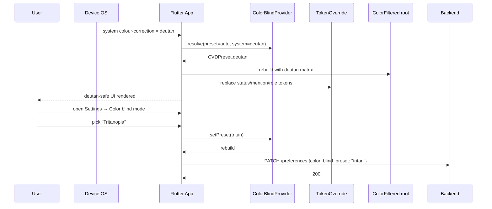

# Color Blind Mode — App Flow

## 1. End-to-End Journey



## 2. State Machine

```
[off]   -- pick auto -->         [auto]
[off]   -- pick protan -->       [protan]
[off]   -- pick deutan -->       [deutan]
[off]   -- pick tritan -->       [tritan]
[auto]  -- system off ->         [resolved_off]
[auto]  -- system deutan ->      [resolved_deutan]
```

## 3. User Journeys

### J1 — Happy path: deuteranope opts in
1. Marko opens Flicko; doesn't have system colour correction set.
2. Settings → Accessibility → Color blind mode → "Deuteranopia".
3. Status indicators recolour to teal; mention badge becomes blue.
4. Status indicators also gain shapes (●▲■◆).
5. Marko leaves Settings; preference persists, syncs across devices.

### J2 — Admin warned about role colour
1. Avi creates a role "Helpers" with #2E7D32 (forest green).
2. The role colour picker shows "⚠ Fails for deutan".
3. Avi taps "Show safe palette", picks #1565C0 (blue) instead.
4. Warning resolves.

### J3 — Filter toggle off, palette only
1. Marko likes the palette swap but feels the filter changes uploaded photos too much.
2. Toggles "Apply filter to images" off.
3. Now: token overrides remain but `ColorFiltered` becomes identity → photos render true to source.

### J4 — Reduced motion + CVD active
1. With reduced motion on, settings switch fades happen instantly.
2. Live preview swaps without animation.

### J5 — High contrast + CVD active
1. HC palette runs through the CVD daltonization matrix.
2. Both contrast and colour-distinguishability are preserved.

## 4. Edge Cases

- **System colour correction already set:** auto mode aligns; we do not double-filter (warn user once: "Your device already corrects colour; Flicko will follow.")
- **Server custom accent:** kept; we don't recolour brand identity unless HC is also on.
- **Custom emoji / stickers:** unfiltered (decorative; users can disable filter for these).
- **Image-heavy channels (art server):** users who need source colours toggle filter off; one-tap revert from inside chat.
- **Web platform:** filter applied via CSS `filter: matrix(...)` for performance.

## 5. Background / Async

- None.

## 6. Notifications

- None new.

## 7. Cross-Feature Interactions

- With **screen-reader-full**: status announcements include role state ("Asha online") so reader users get the same info.
- With **high-contrast-mode**: combined; matrix applied on top of HC tokens.
- With **reduced-motion-mode**: transitions instant when reduced.
- With **dyslexia-font**: independent.
- With **captions-voice-video**: speaker-palette is daltonized when CVD active.

## 8. Telemetry Events

- `accessibility.cvd.set` { preset, source: "manual"|"system"|"onboarding" }
- `accessibility.cvd.filter.toggle` { applied }
- `accessibility.cvd.shape.toggle` { enabled }
- `accessibility.cvd.admin_warning_shown` { server_id, role_id }
- `accessibility.cvd.admin_warning_fixed` { server_id, role_id }
