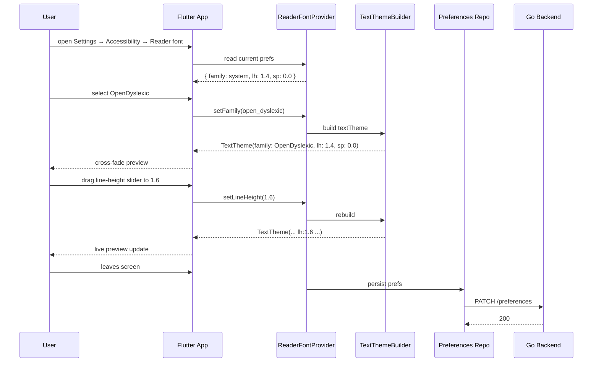

# Dyslexia Font — App Flow

## 1. End-to-End Journey



## 2. State Machine

```
[default]
   │ user opens settings
   ▼
[editing]
   │ user changes family
   ▼
[applying]
   │ TextTheme rebuilt successfully
   ▼
[active]
   │ user persists / navigates away
   ▼
[default] (with new prefs)

[editing] -- font load fail --> [error]
[error]   -- auto revert -->    [default]
```

## 3. User Journeys

### J1 — Happy path: dyslexic student opts in
1. Sam opens onboarding, mentions dyslexia in interest tags.
2. App shows "Reading comfort" step.
3. Sam taps "Try OpenDyslexic".
4. App applies font and slider defaults.
5. After two days of use, Sam tweaks line height to 1.7.
6. Settings persist; sync across phone + tablet.

### J2 — Error path: font asset corrupted
1. App fails to load `OpenDyslexic-Regular.otf` (rare).
2. Provider catches `FlutterError` and reverts to system default.
3. Inline banner: "Couldn't load this font. Reverted to system default."
4. Telemetry event `accessibility.font_load_failed` sent.

### J3 — User decides reader font isn't for them
1. Sets family to System default.
2. Provider clears the asset cache.
3. PATCH /preferences saves the change.

### J4 — Power user adjusts spacing only
1. Keeps system default font.
2. Increases line height to 1.5 and letter spacing to 0.02em.
3. Settings preserved across launches.

## 4. Edge Cases

- **Offline:** preference write queued.
- **Code blocks:** always force JetBrainsMono via explicit fontFamily; reader font does not apply.
- **Rich embeds with custom CSS-like styling:** out of scope; rendered with default font.
- **Server display name in custom font (future):** when available, defer to user pref unless server tag explicitly opts out.
- **CJK text:** falls back to Noto Sans CJK; OpenDyslexic does not provide CJK glyphs.
- **Emoji:** untouched (NotoColorEmoji remains).

## 5. Background / Async

- None.

## 6. Notifications

- None new.

## 7. Cross-Feature Interactions

- With **screen-reader-full**: font choice does not change reader output (text remains the same).
- With **high-contrast-mode**: HC palette + reader font work together; tested combinations are verified in golden tests.
- With **reduced-motion-mode**: preview cross-fade is instant.
- With **dyslexia self-id flag in onboarding**: triggers the proactive nudge.

## 8. Telemetry Events

- `accessibility.reader_font.set` { family }
- `accessibility.reader_font.spacing_adjust` { lineHeight, letterSpacing }
- `accessibility.font_load_failed` { family, error }
- `accessibility.reader_font.onboarding_accept`
- `accessibility.reader_font.onboarding_skip`
